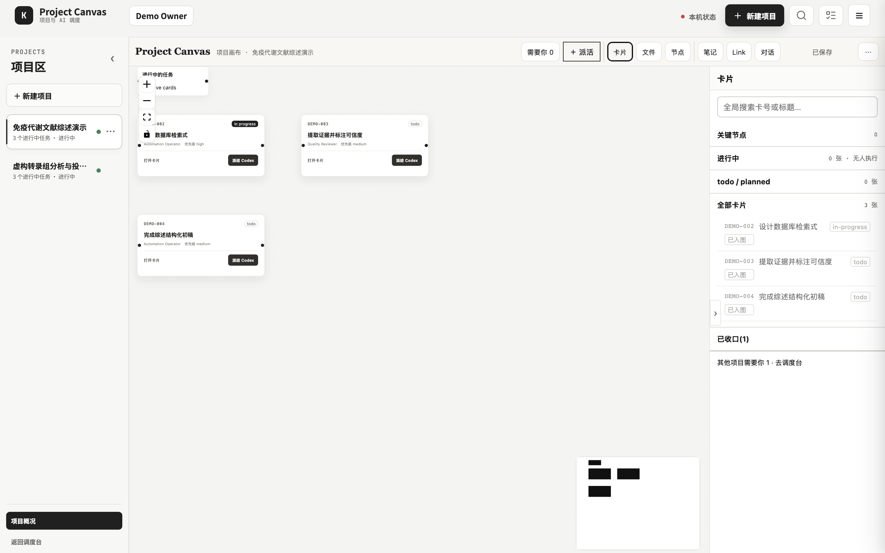
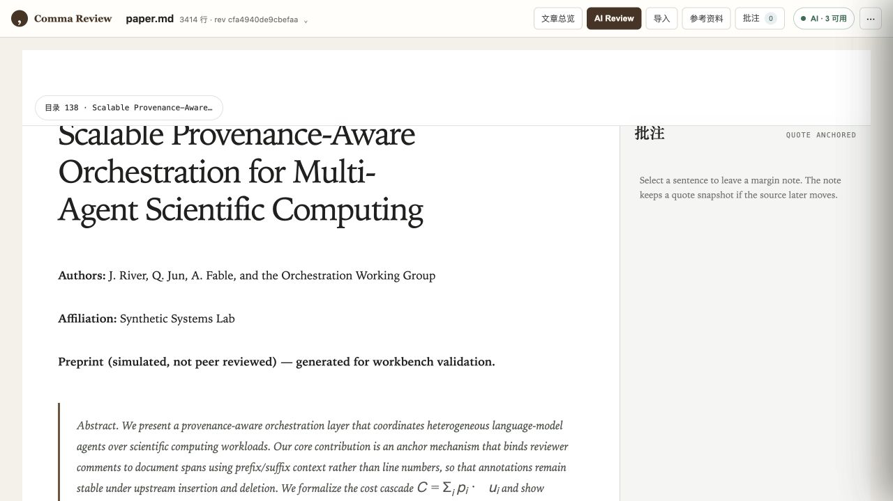
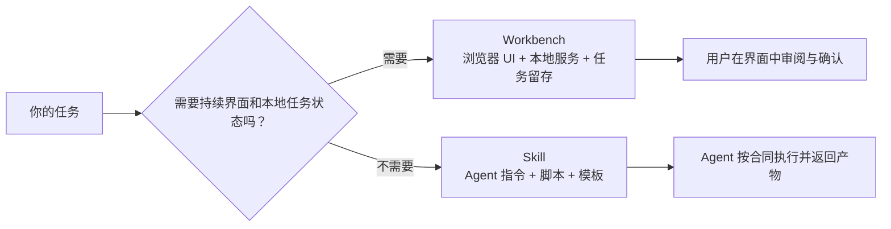

# June Public

<p align="center">
  <strong>面向研究者与内容创作者的本地 AI 工作台、可复用 Skills 与公开知识页面。</strong>
</p>

<p align="center">
  
  
  
  
</p>

这里不是一个单体应用，而是一组可以独立使用的公开工具：有带浏览器界面的本地
Workbench，也有交给 Codex、Claude 等 Agent 执行的 Skill，还有通过 GitHub Pages
发布的 AI × Life Science 信息页面。每个目录都能追溯自己的入口、依赖、隐私边界和许可。

## 先看一眼

<table>
  <tr>
    <td width="33%" align="center">
      <a href="workbenches/project-canvas/">
        
      </a>
      <br><strong>Project Canvas</strong><br>
      任务卡调度台、项目画布与 Codex / Claude 派活复核
    </td>
    <td width="33%" align="center">
      <a href="workbenches/comma-review-studio/">
        
      </a>
      <br><strong>Comma Review Studio</strong><br>
      Markdown / 科研稿件审阅、锚定批注、版本恢复与导出
    </td>
    <td width="33%" align="center">
      <a href="workbenches/scientific-pdf-bilingual-reader/">
        
      </a>
      <br><strong>长 PDF 双语阅读器</strong><br>
      英文长 PDF 翻译、同页双语阅读、质量复核与人闸修复
    </td>
  </tr>
</table>

> 截图使用仓库自带或临时生成的合成演示材料，不包含真实论文、客户数据、账号信息或
> 本地任务记录。

## 这里有什么

| 类型 | 适合谁 | 你会得到什么 | 入口 |
| --- | --- | --- | --- |
| Workbench | 想直接在浏览器界面完成长文档工作的使用者 | 本地服务、可视化工作区、任务留存、人工确认门 | [`workbenches/`](workbenches/) |
| Skill | 已经使用 Codex、Claude 等 Agent，希望复用稳定工作流的人 | `SKILL.md`、脚本、模板、验证说明 | [`skills/`](skills/) |
| Site | 想浏览 AI × Life Science 公开信息源的人 | Source Atlas、作者文献地图入口 | [GitHub Pages](https://mengsj08.github.io/June_Public/) |

### Workbenches

| 项目 | 一句话说明 | 当前平台 / 许可 |
| --- | --- | --- |
| [Project Canvas](workbenches/project-canvas/) | 把任务卡、项目画布和 Codex / Claude 派活收进一个本地 AI 调度台;卡是 Markdown 事实源,复核走独立上下文 | macOS 已实机验证,Linux 未验证;AGPL-3.0 |
| [Comma Review Studio](workbenches/comma-review-studio/) | 把 Markdown / 科研稿件变成可审阅、可批注、可恢复版本的本地工作台 | macOS / Linux 友好；June 源码仅供评估，详见目录 LICENSE |
| [长 PDF 双语阅读器](workbenches/scientific-pdf-bilingual-reader/) | 文本型或扫描版英文 PDF → 中文 PDF + 同页双语 PDF + 确定性 QA + 人工修复环路 | macOS Apple Silicon 已验证；AGPL-3.0 |

### Skills

| Skill | 典型任务 | 主要输出 |
| --- | --- | --- |
| [Author Literature Map](skills/research-tools/author-literature-map/) | 按已确认作者身份生成可核验文献地图 | 单一事实账本、静态 HTML、来源与漂移提示 |
| [小红书自动化 Skills](skills/ip-operations/xiaohongshu-skills/) | 登录、搜索、详情、发布、互动、采集到飞书 Base | 结构化 JSON、浏览器操作结果、飞书记录 |
| [Article Visualization](skills/ip-operations/article-visualization/) | 把论文、研究博客或技术文章做成大众可读的图文 | 科普长图、小红书卡片、公众号封面、短文 |

完整目录见 [`skills/README.md`](skills/README.md)。

## 60 秒开始

### 1. 克隆仓库

```bash
git clone https://github.com/mengsj08/June_Public.git
cd June_Public
```

### 2. 选择一种入口

如果你想直接使用界面：

```bash
# 任务卡调度台 + 项目画布 + AI 派活复核
cd workbenches/project-canvas
./start.sh
```

```bash
# Markdown / 科研稿件评审
cd workbenches/comma-review-studio
npm ci
npm run build
./start-review-studio.sh
```

```bash
# 英文长 PDF 翻译与双语阅读（macOS）
cd workbenches/scientific-pdf-bilingual-reader
python3 scripts/bootstrap.py doctor
python3 scripts/launch.py start --open
```

如果你习惯让 Agent 帮你安装，可把下面这句话发给 Codex 或 Claude：

```text
阅读这个目录的 README、SKILL.md 或 AGENT_SETUP.md。先做只读环境检查，再告诉我
会安装什么、占用多少空间、哪些内容会发送给模型；获得确认后再安装并启动。
```

如果你只需要某个 Skill，进入目标目录，让 Agent **完整读取 `SKILL.md`**，再按其中的
输入、工具和人工确认门执行。不要把整个仓库当作一个需要统一安装的 Python/Node 包。

## 为什么区分 Workbench 与 Skill



Workbench 可以同时携带 `SKILL.md`，让 Agent 帮你安装或启动；但它的产品主体仍是本地
应用。Skill 的主体则是可复用执行合同，不一定有独立 UI。

## 仓库结构

```text
June_Public/
├── docs/                         # GitHub Pages：Source Atlas 与公开页面
├── workbenches/
│   ├── project-canvas/           # 任务卡调度台 + 项目画布 + AI 派活复核
│   ├── comma-review-studio/      # Markdown / 科研稿件评审工作台
│   └── scientific-pdf-bilingual-reader/
├── skills/
│   ├── research-tools/           # 可核验研究工具
│   └── ip-operations/            # 内容生产与平台运营 Skills
└── README.md
```

## 本地优先，不等于完全离线

- Workbench 服务只应监听 `127.0.0.1`，任务文件与运行状态不进入本仓库。
- 使用 Codex、Claude 或其他模型时，完成翻译、审阅或分析所需的文字、页面截图会发送给
  对应模型服务；具体范围以每个项目 README 为准。
- 账号型 Skill 只连接使用者自己的浏览器与账号。仓库不包含 cookie、token、Chrome
  profile、`.lark-cli` profile 或登录态。
- 公开仓库不接收真实客户文档、未发表稿件、运行日志、模型原始 trace、采集结果和未发布
  草稿。

## 验证与许可证

本仓库没有一个覆盖所有子项目的统一构建命令。每个 Workbench / Skill 都在自己的
README 中给出验证方式。

**公开可查看不代表所有目录采用同一开源许可证。** 请在复制、修改、再分发或商用前读取
目标目录的 `LICENSE`、`THIRD_PARTY_NOTICES.md` 和来源说明：

- 长 PDF 双语阅读器：AGPL-3.0。
- Author Literature Map：MIT。
- 小红书自动化 Skills：MIT。
- Comma Review Studio：公开源码审阅与评估，不授予通用复制、修改或商用许可。
- Article Visualization：以目录内现有声明为准；未看到明确许可时不要推定可再分发。

## 公开站点

- [AI4LifeScience Source Atlas](https://mengsj08.github.io/June_Public/)
- [Author Literature Map 介绍页](https://mengsj08.github.io/June_Public/author-map.html)

发现错误或希望复用某个工具时，优先在对应目录核对 README、能力边界与许可，再提交
Issue 或 Pull Request。
