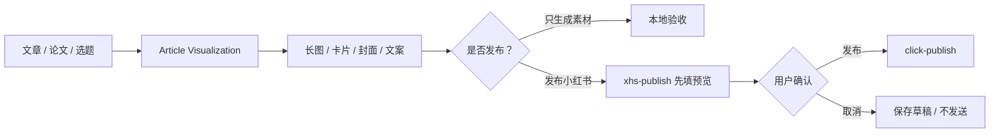

# IP Operations Skills

面向内容研究、可视化生产、账号运营和多平台分发的 Agent Skills。这里的目标不是“让 AI
随便发内容”，而是把选题、分析、生成、预览、人工确认和外部动作拆成可检查的步骤。

## 当前 Skills

| Skill | 你可以让它做什么 | 主要产物 | 外部动作 |
| --- | --- | --- | --- |
| [Article Visualization](article-visualization/) | 把文章、论文或研究博客重新设计成外行可读的科普内容 | 长图、小红书卡片、公众号封面、短文 | 默认只生成本地素材 |
| [小红书自动化 Skills](xiaohongshu-skills/) | 登录、搜索、读取详情、发布、评论、点赞、收藏、复合运营 | JSON、浏览器操作结果、发布预览 | 发布与评论必须人工确认 |
| [Topic to Feishu](xiaohongshu-skills/skills/topic2feishu-xhs/) | 小红书关键词采集、分析改写并写入飞书 Base | 采集 JSON、分析 JSON、Base 记录 | 写入飞书前检查账号与表权限 |

## 推荐组合



也可以先用 `xhs-explore` 研究同类内容，再让 `article-visualization` 生成自己的视觉素材，
最后由 `xhs-publish` 填写发布页。每一步的事实来源和人工确认都应保留。

## 给 Agent 的最短提示词

```text
使用 article-visualization，完整阅读 SKILL.md。先核对原文事实、受众与平台，输出 Page
Plan 给我确认；确认后再渲染小红书图文卡和公众号封面，并运行密度检查。
```

```text
使用 xiaohongshu-skills，先检查我自己的 Chrome 登录状态。搜索“AI for science”相关
图文笔记，整理 5 条高互动内容的选题与结构；不要发布、评论、点赞或收藏。
```

```text
使用 topic2feishu-xhs，先采集 5 条并输出本地 JSON。等我检查分析结果和飞书目标表后，
再写入 Base；不要读取或迁移任何 cookie、token 或本机 profile。
```

## 安装方式

每个目录都是独立 Skill。让 Agent 完整读取目标目录的 `SKILL.md`，或者只把该目录复制
到你所用 Agent 的 Skill 发现路径。不要把整个 `ip-operations/` 当成一个统一 Python
包，也不要覆盖已经存在的同名版本。

依赖不同：

- Article Visualization：Node.js 21+ 与 Google Chrome；无外部 CDN。
- 小红书 Skills：Python 3.11+、uv、Chrome 和项目扩展。
- 写入飞书 Base：额外需要使用者自己的官方 `lark-cli` profile。

## 外部动作分级

| 操作 | 默认可执行 | 需要动作前确认 |
| --- | --- | --- |
| 阅读本地公开文章、生成 Page Plan | 是 | 涉及私有材料时先确认数据边界 |
| 本地渲染图片、运行密度检查 | 是 | 大量下载外部图片前说明范围 |
| 搜索小红书、读取指定详情 | 在用户明确要求范围内 | 大批量访问或扩大关键词范围 |
| 填写发布页但不发布 | 用户明确要求“填好/预览”时 | 必须保持不点击发布 |
| 发布、评论、回复 | 否 | 必须确认最终内容和目标账号 |
| 点赞、收藏 | 否 | 必须确认目标与意图 |
| 写入飞书 Base | 否 | 必须确认组织、Base、table 与写入字段 |

## 账号与隐私

本公开仓库不包含也不应接收：

- Chrome profile、cookie、小红书 token 或登录数据库；
- `.lark-cli` profile、飞书 app secret、user/bot token；
- 本地采集结果、发布草稿、运行缓存、下载图片与未发布截图；
- 客户材料、内部选题库、真实 case 目录与私有日志。

每个使用者连接自己的账号。凭据只通过官方客户端或浏览器保管，不写入提示词、命令行
正文、README、截图或 Git 提交。

## 许可证

各子目录许可证独立。小红书 Skills 为 MIT；Article Visualization 当前目录未提供明确
LICENSE 时，不要推定获得再分发或商用许可。
