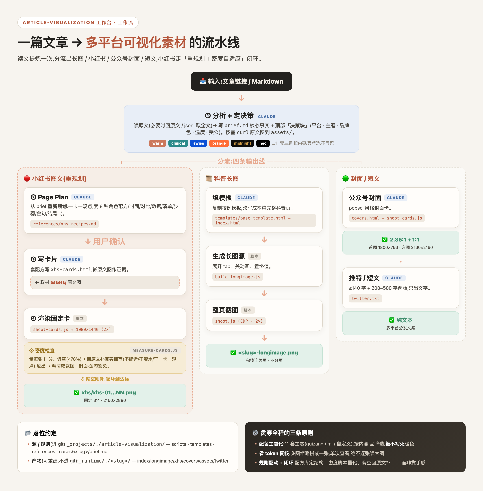
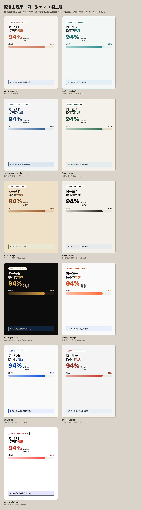

# Article Visualization

<p align="center">
  <strong>一篇文章读懂一次，分流成科普长图、小红书卡片、公众号封面与短文。</strong>
</p>



Article Visualization 不是逐字排版器。它先让 Agent 阅读原文、提炼事实、明确受众与
视觉意图，再由本地脚本完成确定性渲染、截图和密度测量。需要判断的工作交给 AI，需要
可复现的工作交给脚本。

## 适合什么任务

| 场景 | 是否适合 |
| --- | --- |
| 论文 / 研究博客做成大众科普图文 | 适合 |
| 一份 brief 同时产出长图、卡片、封面和短文 | 适合 |
| 先看 Page Plan，再决定是否渲染 | 适合 |
| 把 Markdown 原样转换成公众号排版 | 不适合 |
| 生产级 Web App、SEO 网站或后端系统 | 不适合 |
| 没有证据却生成“看起来真实”的医学数字 | 禁止 |

## 一次分析，四路输出

| 输出 | 规格与特点 |
| --- | --- |
| 科普长图 | 连续 HTML 展开为完整长图，支持数字、进度、Tab 展开等视觉叙事 |
| 小红书图文卡 | 一卡一观点，3:4，按配方库重规划，不从长图机械切片 |
| 公众号封面 | 2.35:1 首图与 1:1 方图 |
| 短文 | ≤140 字与 200–500 字两个纯文本版本 |

## 快速开始

要求：Node.js 21+、本机 Google Chrome。渲染页面为单 HTML、无外部 CDN，可离线打开。

先把这个目录交给 Agent，并发送：

```text
使用 article-visualization，完整阅读 SKILL.md。读取我提供的文章，先写 brief.md：包括
事实清单、受众、平台、主题、品牌色和语气；然后给我小红书 Page Plan。未经我确认不要
渲染。医学与数据结论必须回到原文核实，不要编造数字或图片。
```

典型命令：

```bash
# 长图
node scripts/build-longimage.js /absolute/path/to/case
node scripts/shoot.js /absolute/path/to/case

# 小红书卡片
node scripts/shoot-cards.js /absolute/path/to/case/xhs-cards.html /absolute/path/to/case/xhs
node scripts/measure-cards.js /absolute/path/to/case
```

脚本只完成确定性构建。`brief.md`、Page Plan、卡片文案和事实核验仍由 Agent 与用户共同
完成。

## 建议工作流

1. **读原文**：聚合摘要不够时回到全文或数据源；记录引用和图片来源。
2. **写决策块**：平台、主题、品牌色、温度、受众气质进入 `brief.md` 顶部。
3. **提炼事实**：只保留可以回查的数字、结论、限制和反例。
4. **按平台重规划**：长图、小红书、封面和短文各自组织，不互相机械裁切。
5. **用户确认 Page Plan**：确认一卡一观点、节奏和视觉方向。
6. **本地渲染**：脚本生成 HTML、图片与 contact sheet。
7. **密度检查**：偏空则回原文补同一观点的真实细节；溢出则精简或裁图。
8. **人工验收**：核对事实、错字、裁切、平台尺寸和品牌一致性。

## 主题与卡片配方



内置 11 套主题，包括 warm-popsci、cool-clinical、swiss-bold、forest-ink、
midnight-ink、safety-orange 和 neo-brutalism。主题由内容、品牌与传播意图选择，不应
每次都落到同一种暖色极简风。

小红书配方库 R1–R12 覆盖封面、问题、对比、清单、步骤、金句、大数字、KPI、横向条形
图与矩阵。详细规则：

- [`references/themes.md`](references/themes.md)
- [`references/xhs-recipes.md`](references/xhs-recipes.md)

## 项目结构

```text
article-visualization/
├── SKILL.md                 # Agent 执行合同
├── templates/               # 长图骨架与 11 套卡片主题
├── scripts/                 # 构建、截图、切片、Page Plan 与密度测量
├── references/              # 主题与卡片配方
└── docs/                    # 工作流与主题预览
```

真实 case 应放在仓库外，例如 `/absolute/path/to/case/`，包含 `brief.md`、HTML、assets、
渲染图和来源台账。

## 质量红线

- 不编造数字、引文、医学结论、产品能力或“看起来像数据”的装饰；
- 一卡一观点，补内容只能补同一观点的证据；
- 视觉元素必须服务论点，不堆无用渐变、图标和大数字；
- 原图下载与引用要记录来源；没有授权或无法核实就不使用；
- 不把 API key、cookie、浏览器 profile、私有日志或未发布客户材料写进产物。

## 验证

```bash
node --check scripts/*.js
```

真实验收还应运行一次公开 case 的长图构建、卡片截图和密度检查，并查看 contact sheet。

## 许可提醒

当前公开目录未附独立 LICENSE。公开可查看不等于自动获得复制、修改、再分发或商业使用
权；使用脚本、模板和主题前请先确认许可。
