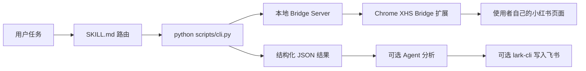

# 小红书自动化 Skills

<p align="center">
  <strong>让 Agent 通过统一 CLI 操作你自己已经登录的小红书：认证、发现、发布、互动、运营与飞书入库。</strong>
</p>

<p align="center">
  
  
  
</p>

这个项目把小红书网页操作封装在一个固定入口：`python scripts/cli.py`。Agent 根据用户
意图路由到六个子 Skill，但认证、搜索、发布和互动都通过同一套 CLI 与 Chrome Bridge
完成，不混用其他 MCP、Go CLI 或历史脚本。

## 能做什么

| 子 Skill | 何时使用 | 关键命令 |
| --- | --- | --- |
| [xhs-auth](skills/xhs-auth/) | 检查登录、二维码 / 手机登录、退出登录 | `check-login`、`get-qrcode`、`wait-login`、`send-code`、`verify-code`、`delete-cookies` |
| [xhs-explore](skills/xhs-explore/) | 搜索、首页 Feed、笔记详情、用户主页 | `search-feeds`、`list-feeds`、`get-feed-detail`、`user-profile` |
| [xhs-publish](skills/xhs-publish/) | 图文、视频、长文、填预览与最终发布 | `fill-publish`、`fill-publish-video`、`click-publish`、`long-article` |
| [xhs-interact](skills/xhs-interact/) | 评论、回复、点赞、收藏 | `post-comment`、`reply-comment`、`like-feed`、`favorite-feed` |
| [xhs-content-ops](skills/xhs-content-ops/) | 竞品分析、热点追踪、创作与互动组合 | 组合 explore / publish / interact |
| [topic2feishu-xhs](skills/topic2feishu-xhs/) | 关键词采集、分析改写、写入飞书 Base | `topic2feishu` + 官方 `lark-cli base` |

## 架构



仓库不内置账号。Chrome 登录状态、cookie 和飞书 profile 都由使用者自己的环境管理。

## 快速开始

要求：Python 3.11+、uv、Google Chrome。

```bash
git clone https://github.com/mengsj08/June_Public.git
cd June_Public/skills/ip-operations/xiaohongshu-skills

uv sync
uv run python scripts/cli.py check-login
```

然后在 Chrome 中通过“加载已解压的扩展程序”加载本目录的 `extension/`，并登录你自己的
小红书账号。重新运行：

```bash
uv run python scripts/cli.py check-login
```

所有后续命令都遵循：

```bash
uv run python scripts/cli.py <subcommand>
```

不要同时接入其他小红书自动化实现。

## 给 Agent 的示例

```text
使用 xhs-explore，先检查登录，再搜索“AI for science”图文笔记，按最多点赞排序，整理
前 5 条的标题、作者、互动数据和内容结构。不要点赞、收藏、评论或发布。
```

```text
使用 xhs-publish，把我提供的标题、正文和图片填写到发布页，但不要发布。让我检查浏览器
预览后，再询问是否点击发布；如果我取消，先保存草稿。
```

```text
使用 topic2feishu-xhs，先采集 5 条并输出 JSON。等我确认分析结果、Base、table 和组织
profile 后再写入飞书。
```

## 登录与发布是两件事

`xiaohongshu.com` 社区页已登录，不代表 `creator.xiaohongshu.com` 创作平台已登录。
发布前必须单独确认创作平台可访问；遇到 `/login`、401、短信页或“发送验证码”时，应让
用户完成创作平台登录，而不是继续上传。

推荐发布顺序：

```text
准备内容 → fill-* 填写预览 → 用户检查 → 明确确认 → click-publish
                                        ↘ 取消 → save-draft
```

只要求“预览 / 填好 / 不发布”时，绝不能调用 `click-publish`。

## 飞书 Base 写入

仅采集小红书时不需要飞书配置。需要写入时，使用者应通过官方 `lark-cli` 配置自己的
profile，并先验证目标表字段权限：

```bash
lark-cli --profile "<profile-name>" base +field-list \
  --base-token "<base-token>" \
  --table-id "<table-id>" \
  --as user
```

`base_token`、`table_id` 和 profile 名是路由参数，不应与 cookie、app secret 或 user
token 混在 README、日志或 Git 提交中。

## 安全边界

- 发布、评论和回复必须在动作前确认最终文本、媒体与目标账号；
- 点赞、收藏也属于外部状态变更，不做未经确认的批量互动；
- 手机号每次登录都重新向用户确认，不从历史记录或记忆中自动填入；
- 频率受控，批量详情读取与互动之间保留间隔；
- 文件参数使用绝对路径，中文正文通过 UTF-8 文件传入，不内联到危险 shell 参数；
- 不读取、输出、迁移或提交 cookie、token、Chrome profile、`.lark-cli` profile、app secret；
- 采集 JSON、下载图片、发布草稿和运行缓存留在仓库外。

## 验证

离线功能测试：

```bash
uv sync --extra dev
PYTHONPATH=scripts uv run pytest
```

维护者可另外运行 `uv run ruff check .` 查看静态检查结果。当前公开快照仍有历史 lint
欠账，因此 Ruff 不是“安装是否成功”的判断条件。

真实账号验收需要使用者自己的 Chrome 与测试账号，并严格区分“只填预览”和“最终发布”。

## 许可证与来源

MIT，见 [`LICENSE`](LICENSE)。每个子 Skill 的精确输入、命令与停止条件以对应
`SKILL.md` 为准。
