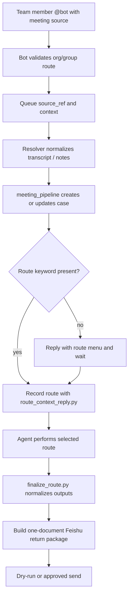

# Team Bot Meeting Material Chain

Use this reference for the team @bot meeting chain, FE72/FM96 automation, old Mac / WOW handoff, and two-machine workspace sync.

For route meanings, output files, review gates, and Feishu document rules, use `references/output_contract.md`. Do not restate or override that contract here.

## Chain Map



## Actors And Boundaries

- FE72 / 智回 group bot is the daily team entry. A user @mentions the bot in an allowed group and pastes a meeting source.
- FM96 AI Notes event automation is optional. It can enqueue new AI Notes events when the Feishu event subscription is active.
- Manual links remain valid even when automatic listeners are disabled.
- Feishu/Lark sources use Lark CLI profiles to decide which organization can read a link. Verify access; do not guess by hostname alone.
- WorkBuddy's built-in Feishu connector is an interaction surface only. Archive writes must go through `lark-cli` with the configured 智回 meeting-chain profile.
- Meeting results archive into 智回 `【内部】脑回路实验室 / 6.AI自动化流水线 / 01_会议分析流水线`.
- Scripts fetch, scaffold, route, normalize, and return. The Agent reads the meeting material and writes the business analysis.
- `source/meeting_transcript.md` is the provenance gate for analysis and return. If resolver cannot land it, it must write `source/source_resolution.json` with `transcript_available:false` and `reason`, and the chain must stop before review approval or return-package creation.

Allowed FE72 group routes are configured by organization/group name:

- `智回/AI技术研发部`
- `智回/AI战略市场部（toB）`
- `智回/能力迁移（🐷也能学AI）`

## Directory Strategy

Use the same relative layout on both machines:

```text
~/Documents/Shape-of-thought/z-h-ai/team-workspace/shared/docs/business_meeting_rawdata/_automation_inbox
~/Documents/Shape-of-thought/z-h-ai/team-workspace/shared/docs/business_meeting_cases
```

Raw inbox is local runtime material: fetched sources, resolver output, raw JSON, and large files that should not enter Git.

Case directory is the reviewed working layer:

- `source/meeting_transcript.md`
- `source/ai_notes.md`
- `source/source_resolution.json`
- `analysis/route_decision.json`
- `analysis/agent_handoff.md`
- route outputs under `analysis/` and `html/`
- `analysis/feishu_meeting_document.md`
- `analysis/feishu_return_manifest.json`
- `case.json`

Default Git behavior: the pipeline writes a publish request and does not automatically commit or push. Review the case first, remove accidental `.DS_Store` files, then run the project publish helper if publishing is desired.

## Route Gate

The route can be chosen in the same @bot message or in a later reply. If the message only contains a meeting source and no route keyword, reply with this menu and wait:

```text
我已收到会议素材。接下来可以走：
1. 默认内部分析：当前 Agent 直接基于会议素材分析，不额外调用专项 Skill
2. 补资料后再选最终产物：先查团队/本地/公开资料，再进入默认分析、客户展示HTML、WOW 或客户洽谈Skill
3. 客户展示HTML：用 meeting-visual-report，先出 Prompt 等确认
4. WOW-Claude：生成 WOW 交接包，人工交互分析
5. WOW-Codex：生成 WOW 交接包，人工交互分析
6. 客户洽谈Skill：明确使用 skill_客户洽谈 分析

请回复数字或名称，例如：1 / 默认 / 补资料 / 客户展示HTML / 客户洽谈Skill。
```

Record the reply:

```bash
python3 "$SKILL_DIR/scripts/route_context_reply.py" \
  --case-dir "<case-dir>" \
  --reply "<用户回复>"
```

If the reply is ambiguous, ask one concrete follow-up instead of continuing. Route meanings and output requirements are defined in `references/output_contract.md`.

Example messages:

```text
@bot https://.../docx/...
@bot 这份 Get笔记会议纪要，默认分析：https://...
@bot <会议链接> 补资料：查一下团队过往客户内容
@bot <会议链接> 客户展示HTML
@bot <会议链接> WOW-Codex
```

## Planned Pauses

- Source access pause: the Agent cannot read the link, the organization/profile is ambiguous, or the connector is missing.
- Route-selection pause: the message has a meeting source but no route keyword.
- Supplement pause: the user asks for `补资料` but does not specify where to search or what material to add.
- Visual prompt pause: customer-facing HTML requires a structured Prompt and confirmation before final HTML.
- WOW pause: WOW-Codex / WOW-Claude is interactive; prepare the handoff and wait for returned outputs.
- Route completion review pause: CRM outputs and customer-facing HTML require confirmation before upload/send.
- Sensitivity pause: material appears to contain credentials, private logs, unrelated customer data, or unsupported claims that would enter a public/customer artifact.

No-keyword messages pause at route selection. They do not go directly to the default route.

## WOW Handoff

WOW is interactive, not a background job.

From the old Mac:

```bash
ssh wow-lan
```

Then choose:

- Claude: run `ccd`; the user enters the WOW login password locally if prompted.
- Codex: run `codex`.

Never write the WOW password into a script, case file, skill, doc, log, or chat. Returned outputs must be copied back into the current case under `analysis/remote_outputs/` and/or `html/`, then finalized through the normal return step.

## Feishu Return

Every final route ends with `finalize_route.py`:

```bash
python3 "$SKILL_DIR/scripts/finalize_route.py" \
  --case-dir "<case-dir>" \
  --route "<route>" \
  --scan-case
```

After required review and target validation, add `--approve` and, when actually sending, `--send`. Use `--send --dry-run` before enabling or changing a target.

Feishu write mode is defined by `references/output_contract.md`: default single archive document, legacy multi-artifact upload only when explicitly approved.

## Re-run Rules

- If the same case exists, do not overwrite human/Agent analysis unless explicitly asked.
- If generated HTML is wrong, inspect the HTML and selected route before regenerating.
- If an automatic listener was not active, manual @bot links are still valid.
- If both machines can access the shared team workspace, the reviewed case under `business_meeting_cases` is the source of truth.
