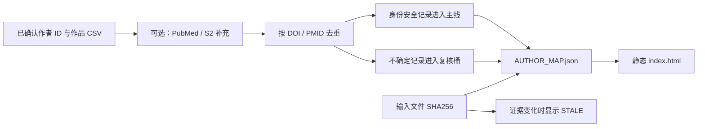

# Author Literature Map｜作者文献地图

> 让“某位作者发表了什么”从模糊搜索结果，变成每条记录都能回查来源的静态文献地图。

[](https://www.python.org/)
[](LICENSE)
[](#30-秒离线体验)

作者文献统计最难的部分通常不是画图，而是确认“这些记录究竟是不是同一个人”。同名作者、数据库拆分 ID 和最新年份收录延迟，都可能让一个看似漂亮的页面建立在错误身份上。

本工具把作者身份设为人工闸门，并以单一账本 `AUTHOR_MAP.json` 驱动指标卡、年份直方图和论文表格。页面上的总数与明细来自同一份数据；输入证据变化后，页面还会显示 `STALE`，提醒你重新生成。

> [!IMPORTANT]
> 这是一个自包含的“验证 + 渲染”工具，不是自动作者消歧引擎。你需要提供已经确认的作者 ID 和作品 CSV。生成这些身份桶的双阶段消歧系统不包含在此公开版本中。

## 为什么这样设计

- **身份由人确认**：同名不等于同一个人，未通过闸门的记录不能进入主地图；
- **单一事实源**：所有统计只在 `AUTHOR_MAP.json` 计算一次，HTML 只负责展示；
- **输入可追溯**：账本记录每个输入文件的 SHA256，证据变化可被检测；
- **多来源可补充**：可接入 PubMed 和 Semantic Scholar，并按 DOI/PMID 去重；
- **不确定项不偷渡**：仅靠姓名搜索得到的身份不安全记录进入人工复核区，而非主结果；
- **核心可离线运行**：示例、账本构建和页面渲染不需要网络。

## 30 秒离线体验

```bash
cd author-literature-map

python3 scripts/build_author_map_verdict.py \
  --run-dir example \
  --author "Jane Doe (example)"

python3 scripts/render_author_map.py \
  --run-dir example \
  --author "Jane Doe (example)"

open example/index.html
```

Linux 可使用 `xdg-open example/index.html`，Windows 可直接双击该文件。示例全部为合成数据，会生成一张包含 5 条作品的静态地图。

## 工作原理



## 准备自己的数据

每位作者对应一个独立的 run directory，其中至少包含一个主地图 CSV，文件名可以是：

- `works_included_main_map.csv`；
- 任意 `*_high_confidence_missing.csv`；
- 任意 `*_main_map.csv`。

最小字段：

| 字段 | 说明 |
| --- | --- |
| `title` | 论文标题 |
| `year` | 发表年份 |
| `doi` 和/或 `pmid` | 可核验标识；没有 DOI、PMID 和 venue 的行不会作为无来源主张展示 |
| `venue` | 期刊或来源，可选但推荐 |
| `theme` | 可选主题分组 |

可以同时提供两个审计桶：

- `works_review_candidates.csv`：需要人工复核；
- `works_excluded_homonym_candidates.csv`：同名或已排除候选。

一种常见起点，是从 OpenAlex 导出作品后，仅保留已经人工确认的 author ID；但工具不会替你判断这些 ID 是否属于同一个人。

## 可选：增加在线来源

每个补充来源在 run directory 中生成一个 `*_supplement.csv`。重新构建时会自动纳入并去重。

### PubMed 年份补充

```bash
python3 scripts/pubmed_author_supplement.py \
  --fau "Doe Jane" \
  --years 2023-2026 \
  --openalex-csv example/works_included_main_map.csv \
  --out example
```

### Semantic Scholar 补充

```bash
python3 scripts/s2_author_supplement.py \
  --author "Jane Doe" \
  --s2-author-id <confirmed-s2-author-id> \
  --openalex-csv example/works_included_main_map.csv \
  --out example
```

带已确认 S2 author ID 的结果可进入主线；仅按姓名搜索的结果会进入复核桶。API 限流或网络失败时，补充脚本会尽可能保留已经取得的结果，核心地图仍可构建。

然后重新生成：

```bash
python3 scripts/build_author_map_verdict.py --run-dir example --author "Jane Doe"
python3 scripts/render_author_map.py --run-dir example --author "Jane Doe"
```

## 推荐：启用身份闸门

可选的 `profile.yaml` 用来记录已经确认的身份边界：

```yaml
name: "Jane Doe"
profile_status: confirmed
accepted_openalex_author_ids:
  - A5000000001
homonym_risk: "low: single dominant author id, clear DOI overlap"
```

执行检查：

```bash
python3 scripts/assert_profile_confirmed.py \
  --profile profile.yaml && echo "gate passed"
```

当 `profile_status` 不是 `confirmed` 时，脚本以非零状态退出，阻止把未确认身份包装成确定结果。

## 目录说明

| 路径 | 作用 |
| --- | --- |
| `scripts/build_author_map_verdict.py` | 生成唯一统计账本 `AUTHOR_MAP.json`，包含来源拆分和输入 SHA256 |
| `scripts/render_author_map.py` | 从账本渲染静态 `index.html`，并检测证据漂移 |
| `scripts/pubmed_author_supplement.py` | 通过 NCBI E-utilities 做 PubMed 年份补充 |
| `scripts/s2_author_supplement.py` | 通过 Semantic Scholar 做作者补充 |
| `scripts/assert_profile_confirmed.py` | 身份闸门；未确认时拒绝通过 |
| `scripts/build_researcher_profile.py` | 可选的纯文本作者画像摘要 |
| `references/method.md` | 双阶段身份纪律、闸门和展示规则 |
| `example/` | 可立即构建的合成示例 |

## 环境要求

- Python 3.9+；核心仅使用标准库；
- `PyYAML` 仅在读取 `profile.yaml` 身份闸门时需要；
- 在线补充需要网络，核心账本和渲染不需要。

## 交给 Agent 使用

```text
阅读这个仓库的 README 和 references/method.md。先检查我的 run directory 是否满足字段和身份闸门要求；不要自动合并同名作者。通过后构建 AUTHOR_MAP.json，渲染 index.html，并报告主线、待复核、已排除数量及输入证据哈希。
```

## 许可证

MIT，详见 [LICENSE](LICENSE)。
