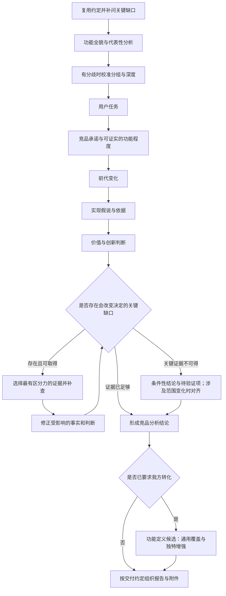

# 医疗器械竞品解码

研究主线提出问题、形成判断；调研补充能改变判断的证据。产出应让读者理解一项功能做什么、做到什么程度、可能怎样实现、为何有价值，以及仍需查清什么。

## 进入任务

从已有对话、文档及资料提取研究对象、版本/地区/时间范围、产品用户与场景、报告读者及其背景、要支持的决定、责任范围和交付位置。产品用户与报告读者分别记录。复用已有族谱中的前代基线与来源，只补本轮关键功能的缺口。

先读已有资料，建立轻量功能清单。用代表性的产品页、宣传和说明书摸清全貌，不默认穷尽型号、专利或新闻。用户明确要求穷尽盘点时执行该范围，并把覆盖情况作为附件支持主线。

保留产品功能名称，用同一套名称贯穿正文；合并营销别名、拆分不同任务时解释对应关系。不要先给用户一套内部模型编号，也不要从功能数量推断模型数量。

## 交互与交付约定

用户决定用途、重点和交付范围；AI负责取证、分析并提出有依据的建议。已有约定与授权直接复用，只问缺失或发生变化、且会影响方向、投入或交付的事项。来源选择、事实核验和实现判断不交给用户代做；用户认可也不替代事实证据。

| 节点 | 何时需要交互 | 带什么让用户判断 |
|---|---|---|
| 开始研究前 | 读者、用途或竞品/我方设计范围不明确，且不同答案会改变研究 | 简述已有理解，只问关键缺口；普通分析深度可先用样例校准 |
| 初步全貌后 | 功能分组有多种合理拆法，或全部深挖会显著扩大投入 | 一张全貌表和一项代表性分析，附建议分组、重点与理由；不等全文完成后才对齐 |
| 研究分岔时 | 关键证据不可得，或新发现需要改变目标、扩大范围 | 当前条件性判断、继续补证的收益与代价、可选方向；普通补查自行继续 |
| 转入我方设计时 | 原任务仅分析竞品，且尚未要求转化 | 竞品结论可支持的设计问题、拟转化范围与分工；已有明确要求时直接执行 |
| 制作交付版前 | 载体、阅读深度、正文/附件或分享范围尚未明确，或相较工作记录发生变化 | 简短目录或页面样例，以及拟保留、节选、移出的材料类别；不让用户逐文件筛选 |

约定用工作记录简要保存，不要求写成报告章节。可以分阶段对齐，避免一次问完所有事项；确认前先完成已有授权下的初稿和独立工作。若关键选择确实决定后续方向，则等待回答再做依赖部分；未回复不算确认，不据此扩大范围或发布。

## 每项功能的分析链

1. **用户任务**：谁在何时要解决什么问题？理想完成状态是什么？不预设必须由 AI 实现。
2. **竞品功能程度**：分别写清厂商承诺、说明书支持的操作与限制、实际观察到的输出、独立验证的效果。若只有宣传，就报告承诺和未知，不能填成实际能力。分清展示、解释、推荐、执行及执行后反馈。
3. **前代变化**：比较任务、输入、输出、交互、处理逻辑及效果。区分旧功能、新命名、能力增强、新集成或新任务；未取得旧版本证据时，不用当前网页倒推上市时状态。
4. **有依据的实现假说**：先给最吻合证据的候选，说明输入→处理→输出；有竞争解释时列替代候选、支持理由及区分它们的观察。按相关性读说明书、专利、论文或技术资料；需要训练的候选才分析标签与训练数据，不默认使用大模型。无实施证明仍可判断可能性，但不给无依据的精确概率。
5. **价值与创新判断**：结果是否解决用户任务？误差会影响什么行动？需要什么比较才能证明增量？区分算法、控制、设备集成、交互与服务组合的创新；自身产品首次出现不等于行业首创。成熟技术也可能构成有价值的产品升级。
6. **功能定义候选**：只有用户需要向我方产品转化时，提出能力要求、可用输入、输出与边界、实现候选、依赖和验收标准。标明建议/用户已定/客户已确认；不把研究顺序变成开发排期或替工程负责人设计整机。

分析卖点时，先找它回答的用户问题，再拆开测量、计算、解释和后续处理。分别判断技术新颖性、实际用途和宣传是否准确：功能增加了什么，用户因此多知道了什么、少做了什么，或能采取什么行动？有意义的新结果、组合方式或更好用的交互也可能构成产品改进，不要求每项底层技术都首次出现；新的名称本身也不能证明功能增加。借用学术概念时，核对实际测量和计算是否符合其定义；论文可解释指标为何有意义，不能替代目标产品的实现与效果证据。需要校准时参考 [低氧负荷教学案例](references/calibration.md#例五成熟测量怎样成为新卖点)。

事实与判断放在同一行，用状态区分，不把证据移到远处后只留结论。正文模板见 [assets/analysis-template.md](assets/analysis-template.md)；按任务删减空章节，不机械填满。

## 定向补证循环

先用现有资料写一版不完整但有判断的分析，再列缺口。每次继续调研都回答：

- **缺什么**：哪一项事实或假说仍不确定？
- **影响什么**：不同答案会改变哪个功能定义、价值判断或实现选择？
- **查什么**：哪种资料或观察最能区分候选？
- **何时停止**：得到什么证据便足以支持当前决定？

优先处理影响大、可取得、最能区分候选的证据。实际报告样例可能比更多专利更有价值；交互实测可能比额外新闻更能说明功能程度。找不到关键证据时保留条件性判断与验证方案，不用外围资料数量填补。

达到本轮决定需要的证据水平、剩余不确定性不影响该决定时停止。若决定确实依赖不可得的关键证据，则标为暂不能决定，说明需要的实测或外部回件，不宣称已完成验证。出现新功能、新来源或反证时重新打开对应环节。

复杂分析或用户要求流程图时，可使用下图；没有必要每次展示流程。

## 判断边界

- 来源标明产品/版本/地区、日期、原文定位或可打开的链接；把厂商自述与独立效果证据区分开。转载同一通稿、多个代理沿用同一资料，不算独立佐证。
- 专利可揭示架构与提交时点，不能证明量产采用、实际性能或研发起始日；未检出也不证明未研发。其他算法/人群/传感器的论文不能当作目标产品实测。
- 竞品选择某路线可以启发候选，但不能直接证明选择原因或排除其他路线。缺失展示不是不存在，功能目的相近不是实现相同。
- 有效果风险的功能，区分测量可靠性、模型性能与用户行动价值；不因输出看似合理就认为任务完成。
- “不是新技术”不等于“不值得提供”。对我方转化，先核对通用能力是否覆盖，再讨论独特增强；补齐用户任务不等于照搬未经证实的承诺，替代路径有输出差异时明确标出。
- 明确竞品实现推断、我方候选设计、已确认需求三者边界。若用户只要求分析竞品，则到价值与创新判断为止。

## 交付与更新

按已对齐的读者和用途裁剪 [正文模板](assets/analysis-template.md)，不机械填满：

- **先全貌，后重点**：全貌表负责比较；逐项展开补充实现依据、替代解释及价值边界，不复述整表。熟悉行业的读者简化背景，事实、依据与判断保持相邻。
- **工作记录与报告分开**：正文保留当前判断；个人讨论、研究过程、旧版本与我方取舍留在工作记录，仅在交付范围需要时纳入。编写说明独立留存，不反复解释报告怎么写、该怎么看。
- **附件按判断选择**：说明每份附件支撑什么或供读者查什么；可节选相关内容，标明节选、出处、必要上下文与修订，保留原件。无关材料不打包，检查附件中的深层链接，避免带回已排除的讨论或旧整包。
- **按形式验收**：Markdown 文档检查结构、来源与版本；HTML检查页面、导航、附件和本机路径依赖；发布范围与授权已有时直接执行，发布后核对线上正文和附件。制作报告本身不等于授权发布。

删掉不改变理解或判断的背景、重复结论和编写过程说明；保留解释结论所必需的细节与证据，不设统一字数上限。

用具体问题、动作和结果解释产品；官方功能名与专业术语保持准确，必要时紧接通俗解释。少用“赋能、画像、承接、支点”等抽象词替代说明，不把正文写成宣传口号或分析框架的复述；引用原名时保留原名，解释它究竟做了什么。

复核主结论是否有依据、反证是否改变排序、哪些缺口会影响下一步。每轮交付说明“当前判断、相比上一轮改变了什么、下一处最值得补证的缺口”。更新已有文档时先读取最新内容，修改对应功能；不在顶部不断叠加历史，不默认写入未授权的外部应用。

需要校准分析尺度或遇到“查得多但判断少/判断强但证据弱”时，读 [references/calibration.md](references/calibration.md)。
