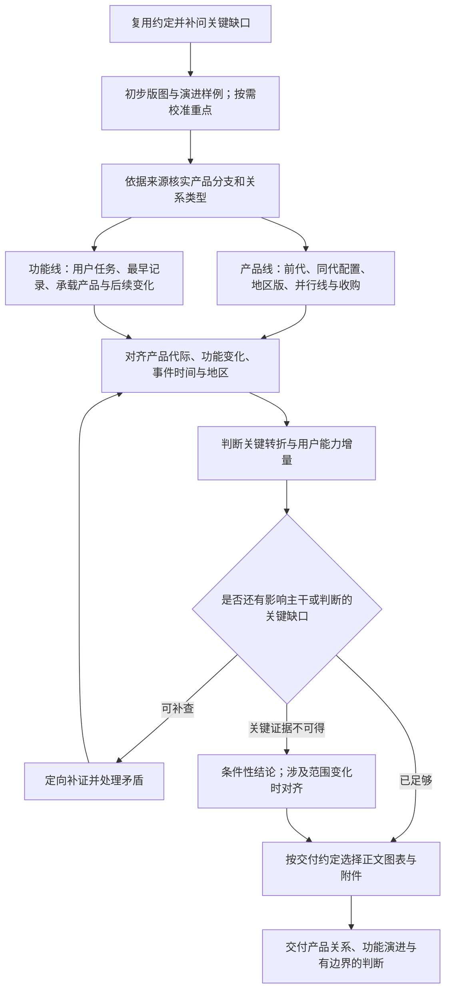

# 产品与功能族谱调研

回答：有哪些产品分支，它们是什么关系；各项用户能力何时出现、由谁承载、后来改变了什么。用证据支持阶段判断，让族谱成为后续功能定义的基础。

## 进入任务

从对话和已有文档确定品牌、时间截止点、地区、产品层级、报告读者及背景、用途和交付位置。明确侧重认清产品线、追溯发布还是判断功能演进；区分主要家族、代表型号与全型号盘点。用户要求“所有产品”时建立覆盖清单，不能因精简正文而缩减研究范围。暂不可穷尽的分支列为未覆盖，不报虚假的完成率。

先读既有研究、原始资料索引及纠错记录。旧分析提供检索线索，不自动成为事实；有冲突时追溯原始来源，不能把多个代理转述同一文档当作独立佐证。

## 交互与交付约定

用户决定用途、重点和交付范围；AI负责核实关系、时间、功能及增量判断。已有约定与授权直接复用，只问缺失或发生变化、且会影响方向、投入或交付的事项。不要让用户凭偏好裁定代际关系或日期；用户认可不能替代来源。

| 节点 | 何时需要交互 | 带什么让用户判断 |
|---|---|---|
| 开始研究前 | 读者、用途、地区或盘点层级不明确，且会改变研究 | 已有理解与关键缺口；说明不同范围会影响哪些分支和深度 |
| 初步版图后 | 合理的展示分组有多种，或长尾分支会显著扩大投入 | 简版族谱和一组产品/功能演进样例，建议重点；事实关系仍由来源核验，不交用户投票 |
| 研究分岔时 | 关键关系或首发证据不可得，或新发现需要扩大目标 | 当前可成立的图谱、未解问题的影响和继续补证选项；普通补查自行继续 |
| 转入我方设计时 | 仅做族谱但准备加入我方功能、路线或开发建议 | 可供转化的前代基线与增量、拟进一步拆解的范围；已有明确需求则执行 |
| 制作交付版前 | 载体、阅读深度、正文/附件或分享范围尚未明确，或发生变化 | 简短目录或图表样例，建议哪些图表进正文、哪些供查阅；按类别说明附件取舍 |

约定简记在工作记录，不要求成为报告章节。分阶段只问当前关键项；先提供已有授权下可完成的初稿并继续独立工作。关键选择决定方向时等待回答再做依赖部分，未回复不算确认，不据此缩减范围、扩大任务或发布。

## 双线工作流

### 1. 建立版图，先辨关系

按用户任务和产品定位分支，涵盖本轮相关的设备、软件、服务、配套或收购业务。分别识别品牌、平台、系列、型号、营销别名，不混合计数。

每个关系明确属于：后继代际、同代配置、并行用途、地区变体、更名、兼容/集成、收购归属。只有存在后继依据才画代际箭头；共同算法、相似名称、发布时间先后及性能高低都不足以证明替代。后继关系也不意味着前代已退市。

关系不确定时保留独立节点或用标注“待核”的虚线。图中箭头注明含义；采购、集成和平台继承不能共用无标签的箭头。

### 2. 产品线：记录发生了什么

按事件记录发布、展示、监管许可、测试开放、开始供货、地区上市、功能上线、改名、收购及退市。一个产品可以有多条事件，不能压成一个含义不明的“上市日期”。

日期保留原有精度与口径：发布日期、实际事件日、计划日、观察日分别存放；年、季度、财年和“最迟已出现”不能补成精确日期。当前在售状态须单独核验，历史发布或官网残留页不证明当前供货。

### 3. 功能线：沿用户任务追溯能力

先用用户能理解的功能名称归一营销别名，并保留原名映射。追踪每个功能的任务、输入、输出、交互/执行程度、依赖、限制和可比效果。功能跨产品迁移时保留承载关系；硬件换代不自动意味着软件功能同时发布。

把“最早取得的记录”与“明确首发”区分开。前者只能作为时间上界：最迟此时已有该表述或能力。旧产品今日页面出现的新文案，不能倒推为旧产品上市时就有。对重要的首次出现，核查更早版本及同期替代产品，写清检索范围。

### 4. 两线交叉，给出变化判断

在同一行连接：**用户任务 → 前代基线 → 本代能力/主张 → 增量 → 依据与判断**。使用一致功能名，避免另造内部模块编号。优先判断新增任务、可见输出变化、输入/算法/控制变化、交互简化、设备集成、地区适配或仅命名变化；允许组合判断，不强行互斥。

事实、实现假说、价值判断可同表，但须标明身份及各自依据。未拿到实现证据仍可给出最吻合资料的条件性判断，说明替代解释与能改变结论的证据；不能反复列“未知”而不判断重要性，也不能把未检出新技术写成没有创新。

“自家首次”“某产品类别首次”“某地区首次”“行业首次”分别核查。厂商称首创先记录为厂商主张；旧能力集成也可能有用户价值，新增输出仍不等于效果已验证。

### 5. 围绕关键缺口补证

每轮明确：缺哪一条关系/日期/能力证据，答案会改变什么，去哪里查，什么证据足以结束本轮。优先修复主干误连、首发时间混淆和影响增量判断的缺口，再处理长尾型号。

查日期、地区冲突或证据不足时，阅读 [证据与关系规则](references/evidence-rules.md)。只在判断实现增量确实需要时深入专利与论文；它们不替代发布证据。工具取证受阻时记录未取得的对象，不用搜索摘要冒充说明书全文。

在声明范围内主干已对齐、关键变化能形成有边界的判断、剩余缺口不会改变本轮用途时收口。若关键证据不可得，交付部分结论及明确缺口，不能宣称覆盖或验证完成。用户要求穷尽时，另报哪些分支已查、哪些尚缺，不以资料总数作完整性证明。

## 交付与更新

按已对齐的读者和用途裁剪 [交付模板](assets/genealogy-template.md)，不机械填满：

- **先全貌，后重点**：先给主要分支与关键变化。族谱图解释关系，事件表定位时间，功能矩阵比较能力；按用途选择正文与附件，不三遍重述同一历史。熟悉行业的读者简化背景，事实、依据与判断相邻。
- **工作记录与报告分开**：正文保留当前判断；个人讨论、检索过程、命名争议的处理过程和旧快照留在工作记录。未解且影响判断的冲突仍须呈现；我方取舍仅在交付范围需要时加入。编写说明独立留存。
- **附件按用途选择**：每份说明支撑的关系、日期或增量判断。可节选但标明出处、必要上下文与修订，原件保留；无关材料不随报告打包。检查深层链接，避免带回已排除的讨论或旧整包。用户要求的全量台账仍须交付，可放附件。
- 大规模或多次更新时，可将事件表独立为 CSV，保留稳定的产品、功能、事件和来源 ID；图表由同一记录派生，避免各处日期漂移。
- 每轮更新先读取已有成果，局部修订受影响的关系与结论，保留纠错理由；不要把整个研究过程不断追加到正文开头。
- **按形式验收**：Markdown 文档检查结构、来源与版本；HTML检查页面、导航、附件和本机路径依赖；发布范围与授权已有时直接执行，发布后核对线上正文和附件。制作报告本身不等于授权发布。

删掉不改变理解或判断的背景、重复结论和编写过程说明；保留必要证据与解释，不设统一字数上限。

交付前检查 [校准案例](references/calibration.md) 中相关陷阱。说明范围、验证程度和真正影响下一步的缺口。

用户随后需要功能定义时，提供本研究的用户任务、前代基线、增量与依据作为输入；进一步拆实现候选和验收标准属于下一层分析，不自动生成我方开发排期或替用户决定功能取舍。本 Skill 可独立完成，无其他 Skill 运行依赖。
