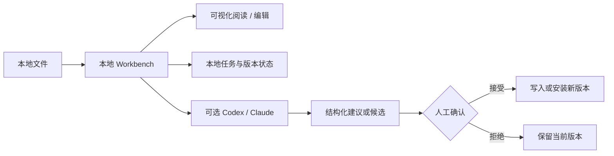

# Workbenches

Workbench 是一类可以在本机持续运行的浏览器工作台：它不只教 Agent “怎么做”，还拥有
自己的 UI、本地服务、任务状态、版本历史和人工确认节点。

## 当前 Workbenches

<table>
  <tr>
    <td width="50%" align="center">
      
       <strong>Comma Review Studio</strong>
    </td>
    <td width="50%" align="center">
      
       <strong>长 PDF 双语阅读器</strong>
    </td>
  </tr>
</table>

| 项目 | 最适合的任务 | 核心界面 | 数据位置 | 公开快照 |
| --- | --- | --- | --- | --- |
| [Comma Review Studio](comma-review-studio/) | Markdown / 科研稿件审阅、锚定批注、版本恢复、导出 | 稿件编辑器 + 批注栏 + AI Review + 版本中心 | 显式 `COMMA_REVIEW_DATA_ROOT` 或本地演示目录 | `comma-editor-kit` commit `73e39d7` |
| [长 PDF 双语阅读器](scientific-pdf-bilingual-reader/) | 英文长 PDF 翻译、OCR、双语阅读、QA、Comment 与批量修复 | 论文库 + 同页阅读器 + 质量复核侧栏 | `~/.local/share/scientific-pdf-bilingual-reader/`，可改写 | 2026-08-13 Stage 0–3 |

## 怎么选择

- 你的工作对象是**持续迭代的 Markdown / 科研稿件**，希望批注与版本绑定：选 Comma。
- 你的工作对象是**英文 PDF**，希望生成中文和同页双语版本：选长 PDF 双语阅读器。
- 你只需要一次性执行说明、脚本或模板，不需要持续界面：转到 [`../skills/`](../skills/)。

## 共同设计

- 本地服务只监听 loopback，不提供公网部署模式。
- AI 默认生成建议、诊断或隔离候选；重要写回仍经过用户确认。
- 用户文档、评论、任务目录、日志、模型 trace 与生成产物不进入本公开仓库。
- 公开截图使用合成演示材料。

## 安装并不是一个统一命令

两个 Workbench 的技术栈不同：Comma 使用 Node.js 构建编辑器并由 Python 提供本地宿主；
长 PDF 双语阅读器使用受管 Python 3.12、PDF 引擎和可选 OCR 运行时。请进入各自目录，
按照 README 执行，不要在 `workbenches/` 根目录盲目安装依赖。

## 模型与隐私

“本地 Workbench”表示文件、任务状态和服务入口由本机管理，不代表模型推理完全离线。
当使用者选择 Codex、Claude 或其他 provider 时，任务所需文本、批注上下文或页面截图
可能发送给相应服务。每个 Workbench README 都给出了更精确的数据边界。

## 许可证

两个 Workbench 的许可证不同：长 PDF 双语阅读器采用 AGPL-3.0；Comma Review Studio
的 June 自有源码只开放源码审阅与评估。使用、修改或再分发前必须分别阅读项目目录中的
`LICENSE` 和第三方告知文件。
