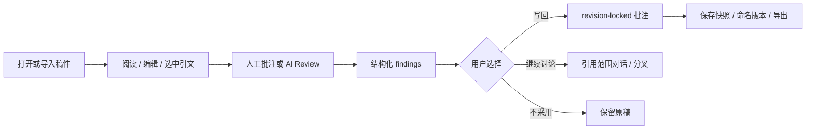

# Comma Review Studio

<p align="center">
  <strong>把 Markdown 与科研稿件放进一个可批注、可审阅、可恢复版本的本地工作台。</strong>
</p>


Comma Review Studio 是一个 local-first 的浏览器评审工作台。它把可嵌入的 Comma Editor
Kit 与 Python 本地宿主组合起来，提供稿件编辑、引用锚定批注、结构化 AI Review、
多轮讨论、版本恢复、冲突草稿和便携导出。

截图中的论文是仓库自带的合成测试稿，不是真实或未发表论文。

## 为什么做成 Workbench

普通聊天很容易把“建议”“原文”“已经写回的修改”混在一起。Comma 把它们拆成可追踪的
对象：

- 原稿始终是可保存、可比较的 Markdown；
- 评论绑定具体引文和稿件 revision，而不是只记一个易漂移的行号；
- AI 先产生结构化 finding，再由用户决定是否写成批注；
- 每次保存都形成内容寻址快照，恢复旧版本不会抹掉后续历史；
- 导出时可以选择纯 Markdown、带评审意见的 Markdown 或完整 Review Package。

## 核心能力

| 能力 | 说明 |
| --- | --- |
| Markdown 稿件工作区 | 阅读、编辑、目录导航、代码块、公式、Mermaid 与图像引用 |
| 锚定批注 | 选中原文添加批注；通过上下文锚点跟随上游插入和删除 |
| Quote-scoped 对话 | 对选中文字快速解释或深入讨论；讨论可以分叉并回写为评论 |
| 结构化 AI Review | 使用本机已有 Codex / Claude / 可用 Gateway，先生成 findings 再核对锚点 |
| 参考 PDF | 本地提取带文本层 PDF 的页码与文字；只有显式加入某轮上下文才发送给模型 |
| 版本与冲突恢复 | 自动快照、命名 checkpoint、恢复时间线、乐观锁冲突草稿与 diff |
| 导出中心 | 原始 Markdown、附评审意见 Markdown、Review Package ZIP；可选 DOCX/PDF |
| 本地审计 | 无正文泄漏的 store audit、旧 comment sidecar 只读检查与显式迁移 |

## 快速开始

要求：Node.js 20+、npm、Python 3.10+。

```bash
git clone https://github.com/mengsj08/June_Public.git
cd June_Public/workbenches/comma-review-studio

npm ci
npm run build
./start-review-studio.sh
```

启动器会先做 doctor，再启动只监听 loopback 的本地服务并打开浏览器。默认地址通常为：

```text
http://127.0.0.1:8891/
```

仓库内置 `apps/review-studio/data/paper.md`，它是专门用于演示的合成稿件。

### 使用自己的文档目录

推荐显式指定一个仓库外的数据目录：

```bash
COMMA_REVIEW_DATA_ROOT=/absolute/private/directory ./start-review-studio.sh
```

主稿以 Markdown 为事实源。DOCX 可经过导入器转成 Markdown；PDF 主要作为带页码的参考
资料，v0 不对参考 PDF 做 OCR，也不会把 PDF 自动并入主稿。

## 一次完整审阅怎么发生



AI 不直接改写原稿。快速解释可以是临时结果；深入讨论与评审 finding 才进入持久台账。

## Codex / Claude 边界

- 使用使用者本机已有的 CLI 安装与登录态，不索取 API Key。
- 页面加载只做版本与登录就绪度探测，不会自动启动模型任务。
- 缺少 provider 时，编辑、保存、批注、版本与导出仍可使用。
- 结构化评审只读取正文、图注和交叉引用文字；不会自动读取图片像素、全文核验引用文献
  或重新计算统计结果。
- 模型调用是本地 CLI 发起的远程推理：提交评审时，相应文本上下文会发送给所选 provider。

## 数据与隐私

本地数据根会保存稿件、comment sidecar、评审 session、对话、版本快照与恢复草稿。请勿
把真实数据根放进本仓库。

公开包不包含：

- 真实稿件、评论、评审账本与引用证据；
- 本地账号、cookie、token、CLI 配置与浏览器 profile；
- 截图之外的模型原始 trace、运行日志、缓存、`node_modules` 与生成构建；
- canonical 仓库尚未提交的开发改动。

服务器只允许 `127.0.0.1` 或 `localhost`，不支持 wildcard、LAN 或远程 Review Studio。

## 项目结构

```text
comma-review-studio/
├── apps/review-studio/     # 完整 Python 本地宿主与浏览器界面
├── src/                    # host-neutral 编辑器核心与 <comma-editor>
├── standalone/             # 纯浏览器本地演示
├── chrome-extension/       # 用户触发的 Chrome Side Panel 外壳
├── tests/                  # 编辑器、浏览器与扩展合同测试
├── docs/ARCHITECTURE.md    # 分层架构
└── EDITOR_KIT.md           # 可嵌入编辑器边界
```

## 开发与验证

```bash
npm ci
npm run check
```

`npm run check` 运行编辑器 Node 测试、Review Studio Python 测试、Chrome 扩展构建与
manifest 验证。若只想启动 Review Studio，仍需先执行一次 `npm run build` 生成
`dist/comma-editor.js`。

更细的宿主、迁移、审计与浏览器验收说明见
[`apps/review-studio/README.md`](apps/review-studio/README.md)。

## 公开快照与许可证

此目录来自私有 canonical `mengsj08/comma-editor-kit` 的提交
`73e39d7b7719578a384cb9346e07b440ad5b0a20`，发布版本 `0.3.0`。精确导出边界和验证结果
见 [`PROVENANCE.md`](PROVENANCE.md)。

June 自有源码当前仅公开用于源码审阅与评估，不授予通用复制、修改、再分发或商业使用
许可。第三方依赖保留各自许可证。使用前请阅读 [`LICENSE`](LICENSE) 与
[`THIRD_PARTY_NOTICES.md`](THIRD_PARTY_NOTICES.md)。
