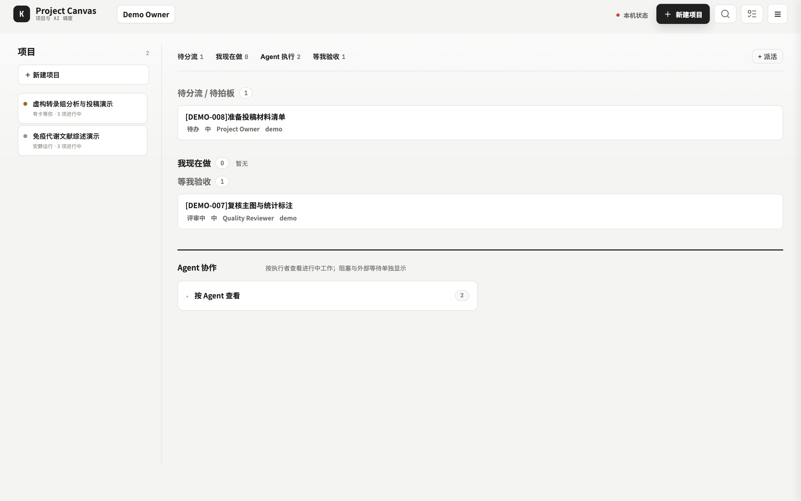
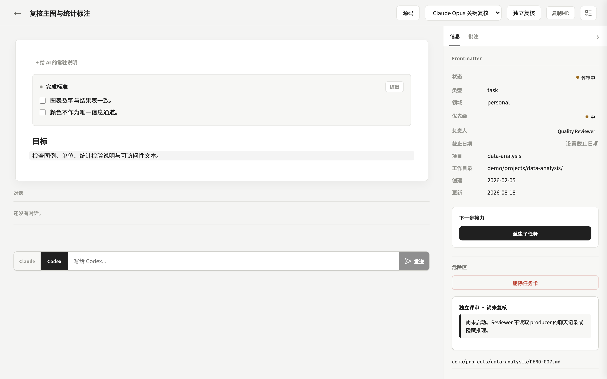
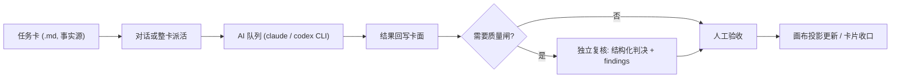

# Project Canvas

<p align="center">
  <strong>把任务卡、项目画布和 Codex / Claude 派活收进一个本地 AI 调度台。</strong>
</p>


Project Canvas(品牌 Intelliflux)是一个 local-first 的浏览器调度工作台。任务卡是纯
Markdown 文件,看板与项目画布是它的两个视图,本机已登录的 `claude` / `codex` CLI 是
它的执行臂:在卡片上对话或整卡派活,结果回写卡面;需要更强的质量闸时,再发起一轮
独立上下文的 AI 复核。

截图与仓库自带数据均为虚构 demo 项目(虚构人名、虚构课题),不含真实任务、客户
数据、账号信息或本地运行记录。

## 为什么做成 Workbench

聊天窗口里的"任务"很容易散:说过的话找不回,AI 干了什么没有账,谁拍的板无从追溯。
Project Canvas 把它们拆成可追踪的对象:

- 任务卡 = 事实源:一张卡就是一个 `.md` 文件,frontmatter 记状态,正文记完成标准与
  执行结果,git 天然可版本化;
- 画布 = 投影:项目画布从卡片确定性生成,人工节点与连线在更新时被保留,不会被
  AI 覆盖;
- AI 运行 = 台账:每次派活进入可见队列,结果落 JSONL,可回放谁在哪张卡上做了什么;
- 复核 = 独立上下文:reviewer 不读取 producer 的聊天记录,按卡面承诺对照实际产出,
  产出结构化判决与逐条 findings;
- 拍板 = 人的动作:验收、建项目、删卡都在人这一侧,AI 只能建议。

## 核心能力

| 能力 | 说明 |
| --- | --- |
| 调度台看板 | 按注意力分组:待分流 / 我现在做 / Agent 执行 / 等我验收;不是简单的状态列 |
| 项目画布 | 卡片、文件、节点、笔记、Link、对话多类对象;一键生成 / 更新投影,自动保存,人工层不被覆盖 |
| 卡片详情 | 完成标准置顶高亮;对卡对话或整卡派活,Claude / Codex 双通道 |
| AI 队列 | 并发控制、运行状态、结果回写;每次运行可见、可终止 |
| 独立复核 | 独立上下文 reviewer 出结构化判决(通过 / 需要修改 + findings),台账落 `.reviews/<卡号>/ledger.jsonl` |
| 真实项目注册表 | 项目身份由 owner 显式登记,任务经 `project_ref` 归入;不按路径或标题瞎猜归属 |
| 安全默认 | 硬绑定 `127.0.0.1`、首启随机 token、扫描目录白名单、AI `workdir` 信任根、写请求同源守护 |

## 快速开始

要求:macOS(Linux 未实机验证),Python 3(含 `venv`)、Node.js 与 npm。AI 功能
需要 `claude`(Claude Code)或 `codex`(Codex CLI)至少一个在 PATH 上且已登录;
没有它们,看板与画布照常可用。

```bash
git clone https://github.com/mengsj08/June_Public.git
cd June_Public/workbenches/project-canvas

./start.sh
```

脚本会建立虚拟环境、安装依赖、构建画布前端并启动只监听 loopback 的本地服务,默认
地址:

```text
http://127.0.0.1:8890/
```

默认加载 `demo/kanban.demo.config.json`:两个虚构科研项目、八张 DEMO 卡。随便折腾,
重置 = `git checkout -- demo/`。无浏览器模式与自定义端口:`./start.sh --no-open`、
`./start.sh --port 9000`。

<table>
  <tr>
    <td width="50%" align="center">
      
      <br>调度台:按「需要你做什么」分组,而不是堆状态列
    </td>
    <td width="50%" align="center">
      
      <br>卡片详情:完成标准、对话派活、独立复核入口
    </td>
  </tr>
</table>

### 第一次 AI 派活与独立复核

打开任意 demo 卡详情 → 选 `claude` 或 `codex` → 发一条对话或整卡派活;运行进入
右上角 AI 队列,结果回写卡面。「独立复核」发起一轮独立上下文审查——demo 卡没有
真实产出物,复核方会如实判「需要修改:制品为空」,这是预期行为,不是故障。

### 从 demo 切到自己的项目

1. 在本目录下建自己的任务目录并放卡,如 `my-projects/pilot-study/PILOT-001.md`
   (frontmatter 至少含 `title` / `task_id` / `status`,照 demo 卡抄);
2. 复制 `demo/kanban.demo.config.json` 为自己的配置,在 `scan_dirs` 加上该目录;
3. 把同一路径加进 `.kanban.scan-allowlist.json`(防御默认:`scan_dirs` 必须同时
   在白名单里才会被扫描,越界会拒绝启动并给出白名单文件位置);
4. `KANBAN_CONFIG="$PWD/kanban.own.config.json" ./start.sh` 重启;
5. 顶栏「新建项目」登记项目身份,卡片可归入该项目。

属于你自己的配置(仓库只提供占位):`members` / `roles` 成员与角色命名、
`real_projects_dir` 注册表位置、git 身份(克隆后你的提交署你自己的
`git config`)、`git_sync` 自动提交(默认关闭)、AI CLI 登录态与额度。

## 一次派活怎么发生



AI 不代替拍板。复核只出判决与建议,验收、收口、删卡始终是人的动作。

## Codex / Claude 边界

- 使用本机已有的 CLI 安装与登录态,不索取 API Key,仓库不含任何凭证。
- 页面加载不会自动启动模型任务;每次派活都是用户显式点击。
- 缺少 CLI 时,看板、画布、卡片编辑与注册表照常可用。
- 派活会把该卡的文本上下文交给所选 CLI,即由你的账号发起一次远程推理;demo 卡
  很小,单次调用在普通 CLI 用量量级。
- AI 的工作目录被限制在配置的信任根内(默认仅本仓库与 `demo/`),越界请求 403。

## 数据与隐私

运行状态文件(`.kanban-state.json`、`*.ai-results.jsonl`、`.ai-queue.json`、
`.kanban.auth-token`)全部 gitignored,不进入仓库。请勿把真实任务目录放进本公开
仓库——自有项目建议放在仓库外并用绝对路径登记,或自建私有仓。

公开包不包含:

- 真实任务卡、真实项目、复核台账与运行日志;
- 本地账号、cookie、token、CLI 配置与浏览器 profile;
- 私有 canonical 仓库的 Git 历史(本目录是无历史冷启动快照)。

服务器硬默认只监听 `127.0.0.1`;对外监听必须显式配置且不代表具备公网部署条件,
部署边界见 [`kanban/DEPLOYMENT.md`](kanban/DEPLOYMENT.md)。

## 项目结构

```text
project-canvas/
├── kanban/          # Python/HTTP 看板服务、静态前端与测试
├── canvas-studio/   # Vite/React 项目画布客户端
├── demo/            # 两个虚构科研项目、八张卡与示例画布
└── start.sh         # 一键启动(建 venv、装依赖、构建、起服务)
```

## 开发与验证

```bash
# 后端测试(start.sh 首次运行后 .venv 就绪)
.venv/bin/python -m pytest kanban/ -q

# 画布前端构建
cd canvas-studio && npm run build
```

当前基线:pytest 600 passed;macOS 实机走通「起服务 → demo 派活 → 独立复核 →
自有目录接入 → 新建项目」全链路(2026-08-18,真实 CLI 凭证)。Linux 有代码与
mock 测试覆盖,未实机验证;Windows 请走 WSL。

## 公开快照与许可证

本目录来自私有 canonical 仓库的冷启动快照,不携带源仓 Git 历史;逐文件来源、
搬运方式与隐私审计交叉引用见 [`PROVENANCE.md`](PROVENANCE.md)。

许可证为 GNU AGPL-3.0,全文见 [`LICENSE`](LICENSE)。项目按现状提供,不承诺
issue 响应、功能支持或 PR 合并。第三方依赖保留各自许可证,见
[`THIRD_PARTY_NOTICES.md`](THIRD_PARTY_NOTICES.md)。
