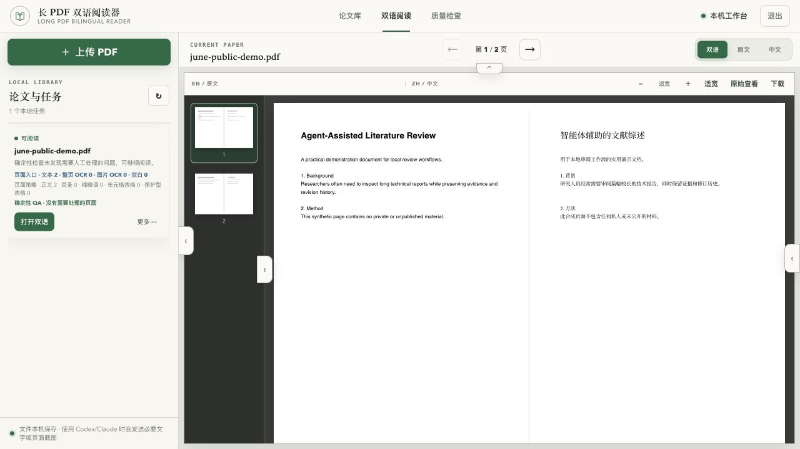
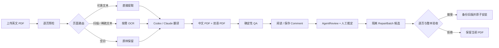

# 长 PDF 双语阅读器

<p align="center">
  <strong>英文科研 PDF → 中文 PDF、同页双语阅读、确定性质量检查与人机协同修复。</strong>
</p>

<p align="center">
  
  
  
</p>



长 PDF 双语阅读器是一个 macOS 本地 Workbench：上传带文本层或扫描版英文 PDF，自动
判断每页应直接提取、进入 OCR 还是原样保留，再通过使用者本机已有的 Codex 或 Claude
CLI 生成中文版本。浏览器里可以同页左右阅读、查看缩略图和确定性 QA，并把人工发现先
保存为 Comment，再立即或批量交给 Agent 审阅、裁定和生成隔离修复候选。

截图使用两页合成演示 PDF，未包含真实论文或历史任务。

## 它解决什么问题

- 百页级英文科研论文、技术报告和规则文件阅读成本高；
- 扫描页、目录、多栏、表格和旋转页不能只靠普通文本翻译；
- “AI 说翻译完成”并不等于没有漏译、错格或覆盖；
- 人工发现往往散落在聊天里，不能跨页汇总、裁定与批量修复；
- 修复如果直接覆盖当前 PDF，失败时难以回滚。

本项目把翻译、QA、人工 Comment、AgentReview、修复候选与最终接受拆成可检查的步骤。

## 核心能力

| 能力 | 说明 |
| --- | --- |
| 文本 / OCR 页面路由 | 可靠文本页直接提取；扫描或稀疏文本页按需进入英文 PaddleOCR |
| 可搜索原文 | OCR 页保留校正图像，并叠加不可见可搜索英文文本层 |
| 页面级翻译策略 | 正文、目录、缩略语、可逐格表格与保护型高密表格分流处理 |
| 同页双语阅读 | 原文与中文左右并排，支持缩略图、翻页、适宽和独立下载 |
| 确定性 QA | 检查文本覆盖、重复字、旋转、区域占用、网格漂移和静默回退风险 |
| 人工 Comment | 任意页只保存意见，或立即交给 Codex / Claude 做只读审阅 |
| 跨页批量审校 | 整篇进度、批量提交待审 Comment、逐条 AgentReview 和人工裁定 |
| 人闸修复 | 批量预检、逐页 PagePatch、最终候选、全篇 QA、接受或拒绝 |
| 失败回滚 | 接受时整组安装中文 PDF、双语 PDF、QA 与逐页计划；任一失败即回滚 |

## 最快的使用方式：交给本地 Agent

如果你使用 Codex、Claude、CodeDesk、CodeBar 或其他本地 coding agent，可以把本目录
交给它，并发送：

```text
完整阅读 AGENT_SETUP.md 和 SKILL.md。先运行只读 doctor，告诉我缺少什么、首次安装
预计占用多少空间，以及哪些文字或页面截图会发送给模型。大型下载、替换已有 Skill、
安装 OCR 前先征得我的确认；确认后完成安装、启动并用 /api/health 验活。
```

Agent 入口详见 [`AGENT_SETUP.md`](AGENT_SETUP.md)。

## 手动快速开始

平台：macOS；Apple Silicon 已验证。需要本机已经可用的 `codex` 或 `claude` CLI。

```bash
git clone https://github.com/mengsj08/June_Public.git
cd June_Public/workbenches/scientific-pdf-bilingual-reader

# 只读检查
python3 scripts/bootstrap.py doctor

# doctor 未就绪时：先确认约 1.0–1.3 GB 长期占用，再安装受管运行时
python3 scripts/bootstrap.py install --yes

# 启动
python3 scripts/launch.py start --open
```

启动器优先使用 `127.0.0.1:8765`；占用时会在 `8876–8895` 中选择可用端口并打印实际
URL。显式端口可通过 `--port` 指定。

OCR 不在普通安装时预装。只有真实任务检测到 OCR 页且运行时缺失时，界面才会说明额外
约 1–2 GB 空间并请求确认。

## 从上传到接受修复



机器 QA 只把高置信、需要人工处理的项目放进主待办；普通技术提示默认收起，避免淹没
使用者注意力。

## 输出文件

| 文件 / 对象 | 用途 |
| --- | --- |
| `translated-zh.pdf` | 中文 PDF |
| `bilingual-side-by-side.pdf` | 原文与中文同页左右对照 PDF |
| `searchable-original.pdf` | OCR 页带不可见文本层的可搜索原文 |
| `ocr-results.json` | OCR 坐标、置信度与告警 |
| `document-plan.json` / `page-plan.json` | 页面路由与翻译策略 |
| `qa-alpha.json` | 确定性 QA 结果、合同与 freshness |
| `review-cycle/` | Comment、AgentReview、人工裁定、RepairBatch / PagePatch 状态 |
| `versions/` | 接受新版本前备份的旧正式产物 |

原始 `original.pdf` 永不改写。候选被接受前不会覆盖当前下载文件。

## 本地优先与模型数据边界

| 内容 | 留在本机 | 可能发送给所选模型服务 |
| --- | --- | --- |
| 原始 PDF 与任务目录 | 是 | 不会整目录上传 |
| 文本翻译所需段落 | 保留副本 | 是 |
| 页面诊断 / 审阅截图 | 保留临时副本 | 仅用户触发相应审阅时 |
| cookie、API Key、CLI 登录文件 | 是 | 不读取、不发送 |
| QA、Comment、候选与版本备份 | 是 | 只有相关结构化上下文按操作发送 |

Codex 翻译与审阅在空白临时工作区运行，并禁用执行、应用、浏览器和多 Agent 工具；
Claude 文本翻译禁用工具，截图审阅只开放临时目录中两张复制图片的读取权限，并禁用会话
持久化。

“本地 Workbench”不代表离线模型。处理机密 PDF 前，应先确认你所选模型服务的组织、
账号和数据政策。

## 适用与限制

适合：

- 英文科研论文、技术报告、规则文档和百页级长 PDF；
- 文本页与英文扫描页混合的 PDF；
- 希望先阅读、积累 Comment，再批量让 Agent 审阅和修复的人。

当前不适合：

- 中文或多语言 OCR；
- 独立 JPG / PNG / HEIC 输入；
- 任意矩形框选 OCR；
- 复杂公式重新排版或出版级版式复刻；
- 已正式验收的原生 Windows 安装；
- 跨 PDF 自动经验库——Stage 4 Experience Candidate 尚未实现。

单文件上限 500 MB；第一次试用建议先用 30 页以内的非敏感英文 PDF。

## 验证

```bash
python3 scripts/bootstrap.py doctor
python3 -m py_compile scripts/*.py
env -u PDF_READER_PRIVATE_REGRESSION_DIR pytest -q
```

当前公开分发形态：`131 passed, 19 skipped`。跳过项需要仓库外私有回归材料；边界说明见
[`references/regression/README.md`](references/regression/README.md)。完整验收合同见
[`references/acceptance.md`](references/acceptance.md)。

## 许可证与第三方组件

项目采用 AGPL-3.0，见 [`LICENSE`](LICENSE)。主要底座包括 pdf2zh / BabelDOC、
PyMuPDF、PDF.js 与可选 PaddleOCR；锁定版本、来源与第三方告知见：

- [`THIRD_PARTY_NOTICES.md`](THIRD_PARTY_NOTICES.md)
- [`references/runtime-lock.json`](references/runtime-lock.json)
- [`references/ocr-runtime-lock.json`](references/ocr-runtime-lock.json)
- [`references/frontend-runtime-lock.json`](references/frontend-runtime-lock.json)

版本历史见 [`CHANGELOG.md`](CHANGELOG.md)，Comment / AgentReview / RepairBatch 设计见
[`references/review-cycle-design.md`](references/review-cycle-design.md)。
