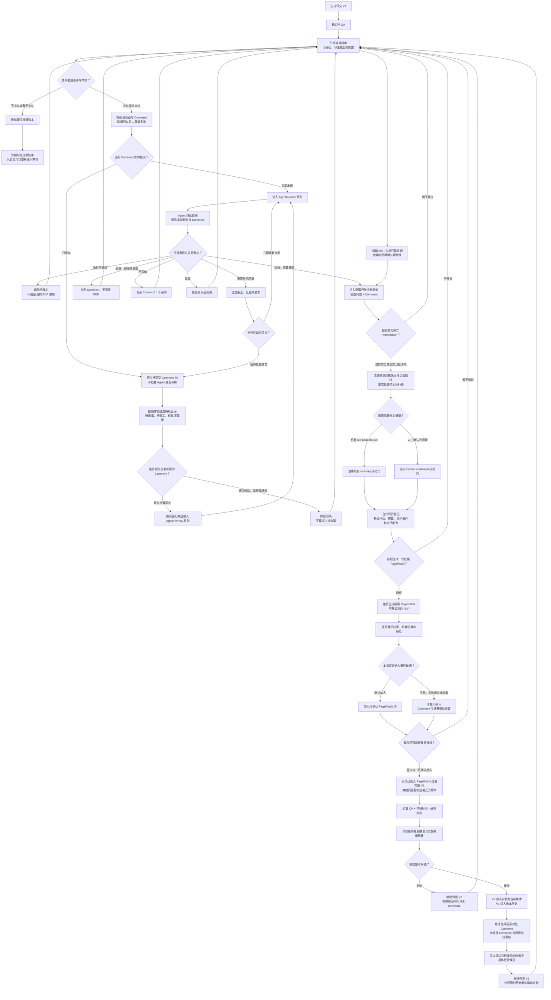

# 全篇 Comment 审校与批量修复周期

> doc_type: target-design · design_revision: 3 · confirmed_by: June · confirmed_at: 2026-08-12 · implementation_status: Stage 0–3 代码路径已实现；整篇入口已通过真实 Comment 数据验收；真实 AgentReview 与真实 RepairBatch 端到端人闸待验收；Stage 4 未实现

## 文档定位

本文记录科研长 PDF 双语阅读工作台的目标审校交互、实施判据与当前落地状态。文中的“已实现”仍须由自动化测试和真实人闸验收共同证明，不能只以文档声明代替。

当前工作台已经支持单页人工反馈、立即交给本机 Codex 或 Claude 只读分析，以及 red hard blocker 的单页候选修复人闸。Stage 0–3 的代码路径已经实现：PageManifest、独立 Comment、只保存 Comment、AgentReview 队列、按页归并审阅、追加式人工裁定、整篇进度、跨页选择、批准修复池、RepairBatch/PagePatch、逐页纳入、最终候选整本 QA 和原子安装。2026-08-12 已在真实 WCPFC 任务上验证 9 条 Comment 跨 8 页的汇总与选择界面，但没有替使用者提交这些 Comment；真实 AgentReview、真实多页候选与最终接受仍需一次端到端人闸验收。跨 PDF 经验候选库仍未实现。现有“诊断与候选修复必须是两个独立动作”“候选接受前不得覆盖当前 PDF”等安全边界继续有效；人工已批准的绿页 Comment 通过 PagePatch 的页面变化、保护条件、无新增 red 和人工逐页裁定共同验收。

## 已确认的设计决定

2026-08-12，June 确认以下两个实施方向：

1. **绿页不放进现有 red-only 通道。** 保留现有机器红页修复路径；另建 `human-confirmed` 路径，只处理已经由使用者明确批准修改的人工 Comment，并使用独立成功判据。
2. **逐页选择纳入，最终整本原子安装。** RepairBatch 可以生成多个隔离 `PagePatch`；使用者按页决定纳入、剔除或暂不处理。系统只用已纳入页组装一份最终候选，并对整本候选执行一次 QA 和一次原子安装。

这两项决定最初用于授权目标设计，现已落实到 Stage 2–3 代码路径；仍不授权绕过候选预览、逐页纳入决定和最终接受门。

## 核心原则

1. 译文版本生成并完成现有 QA 后即可阅读、导出或暂时搁置；人工审校是可选参与，不是必经阶段。QA 有严重问题时仍按现有规则明确标记草稿，不冒充最终完成。
2. 不假定使用者会看完全部页面、写完所有 Comment，或裁定全部 Agent 意见。任何未处理状态都必须可持久保存，并且不阻塞当前 PDF 的正常使用。
3. 一条 Comment 写完后，使用者既可立即交给 Claude、Codex 或其他兼容 Agent 审阅，也可只保存，稍后批量提交当前已经积累的未审阅 Comment。
4. Agent 审阅只向 Comment 追加结构化意见，不直接修改 PDF。立即审阅不等于立即修复；补充信息后产生新的 AgentReview，不覆盖旧意见。
5. 批准修复池接收两类来源：完成只读诊断并由使用者确认要修复的机器 red hard blocker，以及由使用者明确标记为“同意，需要修改”的 Comment。使用者可随时选择其中一部分或全部建立 RepairBatch，不要求其他问题或 Comment 清零。
6. 一次用户授权可以在内部按页、区域和问题族拆分执行。每个目标页先形成隔离 PagePatch，使用者逐页决定是否纳入；最终候选仍须经过全篇 QA、非目标页一致性检查和人工接受。
7. 跨 PDF 经验只能从成功且已接受的修改中提炼。一次成功先形成经验候选；经过 2–3 份独立 PDF 的可靠复用并由 June 确认后，才可晋升为默认可复用规则。
8. 整篇级收口入口在任意页面都必须可见。它可以保持紧凑，但不能因为当前页没有 Comment 而隐藏其他页面已经积累的待审、待裁定或已批准项目。

## 目标流程

## 整篇级收口入口与按钮合同

### 入口位置

质量复核右栏在页码选择器下方常驻一个紧凑的“本篇审校进度”区域。该区域属于文档级状态，不随当前页切换而消失；当前页的问题卡、Comment 输入框和本页历史继续留在下方。默认只显示需要使用者继续处理的计数和一个主动作，详细清单点击后再展开，避免把低价值信息重新堆满右栏。

至少显示以下可重建计数：

- `待送审 Comment`：状态为 `saved` 或可重试 `review_failed` 的 Comment；
- `Agent 审阅中`：queued 与 active AgentReview；
- `待裁定`：已有最新 AgentReview、尚无当前有效人工决定的 Comment；
- `已批准修复项`：满足进入批准修复池条件的机器问题与 Comment；
- `开放修复批次`：当前 RepairBatch、PagePatch 或 CandidateVersion 的下一步状态。

如果所有计数都是 0，只显示弱提示“本篇暂无待提交或待修复项目”，不制造新的注意力负担。只要其他页面存在待办，即使当前页没有 Comment，也必须显示整篇计数与对应入口。

### 主动作状态

| 文档状态 | 右栏主动作 | 点击结果 | 明确不做什么 |
|---|---|---|---|
| 有待送审 Comment | `批量提交本篇待审 Comment（N）` | 打开整篇选择清单 | 不修改 PDF，不自动批准意见 |
| 有待裁定 AgentReview | `裁定审阅意见（N）` | 打开按页归组的待裁定清单 | 不因 Agent 建议自动进入修复池 |
| 有已批准修复项、无 open RepairBatch | `建立修复批次（N）` | 打开修复项选择与预检 | 不直接覆盖当前 PDF |
| 有 open RepairBatch | `继续处理修复批次` | 回到冲突、PagePatch 或纳入决定 | 不新建第二个并行批次 |
| 最终候选已就绪 | `预览最终候选` | 展示全篇 QA、变更页和安装收据草案 | 不自动接受或安装 |

如果同一时刻有多个阶段待办，主动作优先恢复 open RepairBatch 或已就绪候选；其余计数保留为次级入口。界面不得使用含糊的“一键修改”文案，因为一次点击只能进入下一道人闸，不能把诊断、修复和安装合并成一次不可逆动作。

### “批量提交本篇待审 Comment”交互

1. 点击后展示整篇未送审 Comment，按 PDF 页码归组，默认全选；使用者可以取消任意页面或 Comment，不要求看完全文。
2. 每项展示页码、备注摘要、关联机器问题数量、Comment 版本和锚点状态。失锚、版本变化或已经 queued/active 的项不可重复勾选，并显示原因。
3. 提交前摘要显示“选中 X 条 Comment，涉及 Y 页，预计形成 Z 个页面审阅组”。同页 Comment 共用页面证据，但每个 Comment 独立生成 AgentReview 历史。
4. 确认按钮使用 `提交选中 Comment 审阅`；提交成功后立即回到整篇进度，显示 queued/active/failed 数量。部分失败不得撤销已成功入队项，失败项保留并允许重试。
5. 当前页已有 Comment 时，原有“提交勾选 Comment”和“提交本页待审”可保留为快捷方式，但不能代替整篇入口。

### “建立修复批次”交互

批准修复池中的每一项先规范化为 `RepairItemRef`，来源只能是：

- `machine_issue`：当前 QA 仍为 fresh、问题属于 red hard blocker、只读诊断已完成，且使用者已明确确认修复；
- `comment`：目标 Comment 的最新 AgentReview 已完成，且当前有效人工决定为 `agree_needs_change`。

点击“建立修复批次”后：

1. 按页展示所有可选 `RepairItemRef`，默认勾选当前仍有效的已批准项；使用者可只选一部分，不要求清空批准池。
2. 如果一个机器问题已经被某条 Comment 引用并批准，界面标记关联关系；后端按稳定问题 ID、页面区域和目标动作去重，不能把同一修改执行两遍。
3. 选择完成后先生成只读预检：冻结基础正式版本与页级指纹，合成每页唯一 PagePatchPlan，并报告冲突、不支持的动作、保护项、预计 AI 请求、缓存命中和预算。
4. 只有预检通过的页面才可进入 `生成修复候选`。该按钮创建隔离 PagePatch；不合格项留在池中并显示原因，不得静默丢弃或扩大范围。
5. PagePatch 生成后仍按本文既定流程逐页纳入或剔除，再组装整本 CandidateVersion。最终安装继续要求全篇 QA 和独立人工接受。

### 当前页操作与整篇操作的关系

- 当前页机器问题的“忽略此项”“加入 Comment”和“分析选中机器问题”继续负责收集与诊断，不承担整篇修复。
- “只保存 Comment”只写本地；“立即发送审阅”只提交新建的这一条；两者都不会修改 PDF。
- 整篇入口是收口面，不是另一套数据：它读取同一批 Comment、AgentReview、机器问题决定和 RepairBatch 对象。
- 使用者在任意阶段退出后，再次打开任务必须从同一计数与下一步恢复，不能要求返回原来写 Comment 的页面才能继续。

## 目标接口与状态投影

接口命名可随现有路由风格调整，但实现必须覆盖以下语义：

- `GET /api/tasks/{task_id}/review-cycle`：返回文档级 `summary`、按页对象投影、open RepairBatch 和 ready CandidateVersion；`summary` 必须由对象事实重建，不能依赖前端当前页。
- `POST /api/tasks/{task_id}/agent-reviews`：接收来自任意页面的 `comment_ids`；幂等拒绝已 queued/active 的同版本 Comment，并返回逐项 accepted/rejected 结果。
- `POST /api/tasks/{task_id}/repair-batches`：接收显式选择的 `RepairItemRef[]` 和基础正式版本；只创建 open RepairBatch，不执行修复。
- `POST /api/tasks/{task_id}/repair-batches/{batch_id}/preflight`：生成冻结清单、PagePatchPlan、冲突、能力和预算报告。
- `POST /api/tasks/{task_id}/repair-batches/{batch_id}/execute`：仅对预检通过且再次授权的页面生成隔离 PagePatch。
- `PATCH /api/tasks/{task_id}/repair-batches/{batch_id}/page-patches/{page_patch_id}`：记录 `include`、`exclude` 或 `defer`，保留追加决定历史。
- `POST /api/tasks/{task_id}/repair-batches/{batch_id}/candidate`：只用 include 的 PagePatch 组装完整候选并运行全篇 QA。
- 候选的 `accept` 与 `reject` 继续使用独立动作；`accept` 必须验证基础版本未变化并写安装收据，`reject` 不改变当前正式 PDF。

前端不能通过本地数组自行猜测关键计数。服务端至少返回 `pending_comment_count`、`queued_review_count`、`active_review_count`、`failed_review_count`、`awaiting_decision_count`、`approved_repair_item_count`、`open_repair_batch_id` 和 `ready_candidate_id`。

## 对象与版本边界

- `ReviewCycle`：一份 PDF 在某个译文版本上的可选审校周期；可以长期保持开放，也可以在没有人工参与时完全不存在。
- `Comment`：独立事实对象，绑定 Comment 自身版本、正式译文版本哈希、PDF 页码、页级指纹、使用者备注、人工裁定和候选处理结果。后续可增加区域框与文本引用，但页级指纹不是可选增强。
- `AgentReview`：对某个 Comment 版本的只读意见，记录 provider、输入版本、状态和结构化结果。Comment 补充信息后产生新 AgentReview，不覆盖旧历史。
- `PageManifest`：每个已安装译文版本的逐页合同，至少保存 `render_sha256`、`text_sha256`、页面尺寸和旋转信息。Comment 创建、RepairBatch 冻结和新版本接受都引用它。
- `RepairItemRef`：批准修复池中的稳定引用，记录来源类型、来源 ID 与版本、目标页、当前正式版本、页级指纹、使用者批准事件和成功判据；机器问题与 Comment 在此统一进入批次，但不丢失各自来源。
- `PagePatchPlan`：一个目标页上全部已选 RepairItemRef 的唯一合成执行计划。不得把同页多个 case 交给“后写覆盖前写”的映射。
- `RepairBatch`：从批准修复池中显式选中的 RepairItemRef 集合，冻结基础正式版本、逐页指纹、成功判据、预算和目标页。未选机器问题或 Comment 不进入候选，也不阻塞本批次。
- `PagePatch`：某一目标页的隔离修复结果、执行证据和状态。它可以被纳入、剔除或留待以后处理，但不能独立覆盖正式 PDF。
- `CandidateVersion`：只用已纳入 PagePatch 组装的完整 PDF、逐页计划和 QA 结果；接受前不得替换当前版本，接受时整本原子安装。
- `ExperienceCandidate`：从已接受候选中提炼的可复用经验，回链来源 Comment、RepairBatch、PagePatch 和安装收据，但默认不保存论文原文、截图或可识别客户内容。

### 页级版本合同是批量能力前置条件

当前只有整份 PDF 哈希，无法证明“V2 只改了第 5 页，因此第 80 页旧 Comment 仍有效”。在任何 RepairBatch 可以被安装之前，必须为每个正式版本持久化 `PageManifest`。

新版本接受后逐条处理未完成 Comment：

- 目标页指纹完全一致：Comment 继续有效；
- 目标页指纹变化：进入 `needs_recheck`，不得静默沿用；
- 页码消失、页面尺寸或旋转变化：进入 `stale_anchor`，要求重新定位；
- 已由本批次处理：连接 PagePatch 和安装收据，等待或记录人工确认结果。

整份正式版本哈希仍用于防止拿错基础文件；页级指纹用于判断某条 Comment 能否跨版本继续沿用，两者不能互相替代。

## 两条修复通道与成功判据

### 机器 red hard blocker

现有入口保持不变：目标 red 必须消失、不得新增 red、QA 规则版本一致、非目标页不变，并通过候选人工视觉门。

### human-confirmed

人工批准不等于允许任意改写。每条进入该通道的 Comment 必须形成 `SuccessContract`：

- 预期变化：要修正的文本、区域、结构或保护策略；
- 目标范围：页码以及可用时的区域/文本锚点；
- 保护内容：URL、数字、金额、日期、法规编号、缩略语、专名和表格网格；
- 执行能力：当前修复器是否支持该动作；不支持时不得显示执行候选；
- 无损门：不新增 red、非目标页不变、页数与顺序不变；
- 成功类型：`machine_verifiable` 或 `visual_only`。

`machine_verifiable` 必须给出可计算的目标判据，例如目标文本已替换、保护 token 完整、指定区域发生预期变化。`visual_only` 只说明机器未发现新增损坏，不能自动标记“已解决”；对应 PagePatch 只有在使用者视觉确认后才能纳入最终候选。

human-confirmed 是新增通道，不得通过删除现有 red-only 检查实现。

## 同页合成、跨页关系与部分纳入

1. 同一页只能生成一个 `PagePatchPlan`。同页多 Comment 先按区域与问题族归并；兼容操作合成，不兼容操作阻止该页执行并返回冲突说明。
2. 不得用页码字典静默覆盖同页的前一个 Comment，也不得依赖不稳定的 case 顺序解决冲突。
3. 连续目录页或其他语义耦合页可形成一个 `PagePatchGroup`；该组内页面共同纳入或共同剔除。未证明存在跨页关系时，不得扩大修复范围。
4. RepairBatch 可以生成多个 PagePatch，但未检查、失败或被拒绝的 PagePatch 默认不纳入。
5. 最终安装不是把页面逐个写进正式 PDF，而是从当前正式版本和已纳入 PagePatch 重新组装完整候选，重新跑全篇 QA 后执行一次原子安装。
6. 如果最终候选被拒绝，当前正式版本不变；已生成 PagePatch 和拒绝原因保留，后续批次可引用，但不得原地绕过失败门。

## 队列、预算与并发

- “只保存 Comment”是纯本地写入，不检查 Claude、Codex 或其他 Agent 是否可用，也不自动创建 AgentReview。
- 立即发送与批量提交进入同一持久队列。批量提交按页面归并，同页多个 Comment 共用一次页面证据输入，再把结果分别写回对应 Comment。
- 同一任务最多一个 active AgentReview job；其余项保持 queued。停止工作台后，未开始项仍可恢复；被中断的模型调用必须显示失败或待重试，不能伪装完成。
- AgentReview 队列和 RepairBatch 相互独立。RepairBatch 执行时仍可继续保存 Comment；AgentReview 始终绑定调用开始时的正式版本与 Comment 版本。
- 同一任务只允许一个 open RepairBatch。最终安装必须获得短时任务 mutation lock；如果基础正式版本已变化，整个批次进入 stale，不得安装。
- 修复 v1 沿用当前每个 RepairBatch 最多 12 次 AI 请求的上限。预检必须展示预计请求、缓存命中和剩余预算；预计超限时在执行前阻止并建议拆批，不能运行到一半后静默保留原文。
- Agent 审阅批次必须显示页组数、Comment 数、队列状态和失败项；可以分块排队，但不得因数量过多静默截断。

## 持久化、删除与隐私

- Comment、AgentReview、RepairBatch、PagePatch 和收据使用独立对象文件与稳定 ID；对象更新采用原子写、对象版本号和乐观并发检查。列表与计数是可重建投影，不作为唯一事实来源。
- 人工裁定与 AgentReview 使用追加历史；纠正或撤回通过新事件表达，不覆盖旧结论。
- 含 Comment、审阅历史或候选收据的任务属于长期人工资产。删除操作必须先显示对象数量和影响范围，默认进入应用专用可恢复归档/废纸篓；永久删除需要独立明确确认。
- ExperienceCandidate 位于本机应用数据区，不写入 Skill 源码、Codex/Claude 发现目录或公开分发包。默认只保存脱敏后的触发条件、动作、保护项、反例、成功次数和本机来源引用；论文原文、截图、客户名和未发表内容不得进入跨任务经验正文。
- 经验候选晋升为默认规则属于独立 June 决策；达到复用次数只产生晋升建议，不自动改写翻译策略。

## 与 Comma Review Studio 的关系

本设计借鉴 Comma Review Studio 将 document、comment、review session、finding、人工决定和写回收据拆为独立对象的语义，以及“AI 推测已解决仍需人工确认”和版本锁写回原则。两个工作台继续保持独立实现：Markdown Comment 的锚点与 PDF 的页码、区域、渲染哈希、候选文件和全篇 QA 不同，不能直接共享运行时或假定数据结构等价。

## 分阶段实施与使用证据闸

### Stage 0：合同与存储基础

已实现 PageManifest、Comment/AgentReview 稳定 ID、对象版本、原子写、只读聚合投影和可恢复删除边界；批量候选始终依赖页级版本合同。

### Stage 1：Comment 与 AgentReview 层

已实现常驻的整篇审校进度、跨页面选择、批量送审入口、待裁定入口和准确状态计数。2026-08-12 的真实任务 UI 验收确认：9 条待送审 Comment 被正确归并为 8 个页面，当前页即使没有 Comment 也能看到整篇主动作；未在验收中实际提交 Comment。

### 使用证据闸

Stage 1 上线后，至少用一份真实 PDF 证明：

- 使用者确实积累了多条 Comment；
- 至少真实使用过一次批量提交；
- 有 Comment 暂未裁定时，PDF 仍能继续使用且状态可恢复；
- 立即发送与批量提交没有制造重复 AgentReview 或丢失历史。

若真实批量送审与裁定没有形成使用证据，RepairBatch 继续保留为可用但未完成产品验收的能力，不再扩建经验层。

2026-08-12 的真实 PDF 试跑已经证明使用者会跨页积累多条 Comment；新版前端也已正确汇总并展示 9 条 Comment 的跨页批量入口。由于验收没有替使用者点击最终提交，真实批量 AgentReview、人工裁定和 RepairBatch 接受尚未完成，使用证据闸仍处于“界面成立、实际闭环待验收”。

### Stage 2：RepairBatch 与 PagePatch

代码已经实现批准修复池、human-confirmed 成功合同、同页合成、冲突与预算预检、PagePatch 隔离执行和逐页纳入决定。自动化测试覆盖跨页批准 Comment 建批、生成 PagePatch、组装候选和接受；仍需真实 AgentReview 后用真实 PDF 完成一次人闸验收。

### Stage 3：最终候选与版本重核

代码已经实现用已纳入 PagePatch 组装完整候选、全篇 QA、整本原子安装、安装收据，以及未完成 Comment 的页级指纹重核；仍需真实多页候选完成一次最终接受验收。

### Stage 4：经验候选

只从已接受 PagePatch 提炼脱敏 ExperienceCandidate。经 2–3 份独立 PDF 可靠复用后，再向 June 提交晋升决定；不得在第一份 PDF 上自动全局化。

## 本次功能的验收标准

1. 在当前页没有 Comment、但其他页面存在 9 条待送审 Comment 的情况下，右栏仍准确显示 `批量提交本篇待审 Comment（9）`。
2. 整篇清单可以跨页全选、部分选择和取消；提交后同一 Comment 版本不会被重复排队，页面归并不覆盖独立 AgentReview 历史。
3. AgentReview 完成后，只有使用者明确裁定为“同意，需要修改”的 Comment 才增加已批准修复项计数；Agent 的文字建议本身不能自动批准。
4. 符合 red-only 条件并经人工确认的机器问题与已批准 Comment 可以出现在同一个 RepairBatch 选择器中；重复目标只执行一次，同页冲突必须在预检阶段阻止。
5. 点击 `建立修复批次` 只创建和预检批次；点击 `生成修复候选` 只写隔离 PagePatch。两者都不得改写当前正式 PDF。
6. 使用者可以逐页 include、exclude 或 defer；未查看、失败、拒绝和暂缓页默认不进入最终候选，相关对象与原因继续保留。
7. 候选接受前能够预览变更页、全篇 QA、非目标页一致性和安装收据草案；拒绝后正式版本哈希不变，接受后旧版本有备份且安装为原子操作。
8. 切页、刷新、退出并重新打开任务后，整篇计数、队列状态、人工裁定、open RepairBatch 和下一主动作都能恢复。
